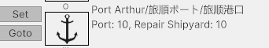

Game Source: https://github.com/yiyuezhuo/Late-Qing-Naval-Combat-Demo

Steam: https://store.steampowered.com/app/3996220/First_SinoJapanese_War/

Discussion: https://steamcommunity.com/linkfilter/?u=https%3A%2F%2Fdiscord.gg%2F2yqbyGwsdQ

# Naval Tactical Mode

WIP

# Strategic Mode

## Strategic Group & Land Unit

WIP

## Movement

WIP

## Supply

WIP

## Naval Transfer

Navy Transfer must be carried out through a naval mission. The Non-Fleet Strategic Groups to be transported via Navy Transfer and the Fleet Group providing the transportation need to be assigned to the mission. During the assembly phase, they will arrive at the assembly point (the first hex of the waypoint). The groups to be transported are generally divided into several parts and loaded onto individual; transport ships, with large formation gradually being emptied until they become small enough to be entirely loaded onto a single transport ship. Upon reaching the destination, the groups will, by default, automatically reorganize into their original formation. The navy transfer may require multiple rounds trips. Once the mission is completed, the transport fleet will remain stationed at the assembly point (it's a good start point for a persistent supply mission).

## Repair

The repair system is inspired by WITP (War in the Pacific). Specifically, damage from SK5 is mapped to a simplified WITP repair model for resolution. (Sample mapping: 1 SK5 Flooding Hit ≈ 20 WITP Flooding Damage Points, or 20% flooding.)

### Tactical Naval Combat damage effect Trim

When a ship’s state is synced to the strategic game, certain adjustments are applied to damage effects. Non-permanent and some specific damage effects are removed.

### Repariable damage

Following state could be counted as a damage:

For example, each max speed offset is counted as separate damage and can be repaired individually to restore the ship's original speed.

Different damage types have different repair point costs and priorities, and are classified as either normal damage or major damage. Major damage can only be repaired by a repair provider that meets the displacement requirement.

### Repair Device

Damage can be repaired by ports and repair shipyards.

| Type | Repair Point Generated | Repair Upper Limit (tons) |
| ---- | ---------------------- | ------------------------- |
| Port (per level) | 100 | 0 |
| Repair Shipyard (per level) | 100 | 1000 |

Repair ships have been added to the game, but their repair functionality will be implemented in a future update.

## Command Structure

Each strategic group has a command point value cost:

- Each land unit under the command will cost the original value.
- Each strategic group under the command will cost 1/3 of its own command point.

Strategic group have a fixed command capacity of 1500. If command point cost is lower than the capacity, the group will be subject to a const penalty based on commander's Land Operational ability:

| Level | Command Penalty | Tactical Modifier |
| ----- | --------------- | ---------------- |
| Barely Competent | 40% | -10% |
| Average (Unknown) | 30% | 0% |
| Above Average | 20% | 10% |
| Outstanding | 10% | 20% |
| Gifted | 0% | 30% |

In the land battle resolution, a unit's "Chance Cost" (basically cost to "activate" this unit) is modified by every layer of engaged commanding layer:

In the above example, if the 9th Combined Bridge is the leading group (If only 1 independent group is engaged, that group is the leading group. If more than one group is engaged in the land battle, weaker groups would attached to the strongest group temporarily. So there's still only 1 group on the top and other attached group will be subject to extra command layer penalty.). This layer will yield a command penalty of 20% since command point is lower than capacity and commander's Land Operational ability is "above average". On the other hand, 11th Inf Regt layer will generate 32% pealty. So 2nd Bn, 11th Inf Regt and 3rd Bn, 11th Inf Regt would be subject to 52% penalty.

If 5th Div is engaged instead of 9th Combined Bridge, the penalty would be stacked with an extra layer introduced by extra command layer.

This design achieves the following effects:

- Bigger land units are hard to activate, so it's less-effective than smaller unit, that's how I implement the "soft combat width".
- Every engaged operational commander in the commander chain make proper effect, instead of strange positive buf stack by enforced layer (EX: HOI) or just no effect on higher layer (EX: ATG).

The penalty system is designed to mathematically ensure that "flatter" command structures generally incur higher penalties. Thus, Japan's modernized hierarchical command structure will typically perform better than China's pre-Napoleonic structure, which lacked permanent formations above the battalion level.

The tactical modifier, however, only affects directly commanded land units and does not apply through the hierarchy.

## Land Battle Resolution

### Sub Combat

Each turn, every unit generates a "chance" value representing its tactical potential. Two chance values would be consumed in a sequence of generated sub-combat for this turn.

For each sub-combat, the two sides roll with their total chance as weight to determine the initiative side. The initiative side becomes the attacker of the sub-combat, while the opposing side becomes the defender. An attacker unit is rolled according to the power weighting and a defender unit is selected based on strength weighting (so low-effective unit -- those with high suppression, fatigue and low morale) would be more likely to be chosen defender than attacker in sub-combat.

The two engaged units then determine their commitment percentage, which is based on a "reference ratio" (e.g., a 300-man unit attacking a 100-man unit with a 1:1 reference ratio would result in the attacker committing 100 men and the defender committing 100 men). The determination of the reference ratio is heavily influenced by the current situation value, which represents the loss or gain of critical advantageous positions. The situation only shifts when the attacker in the sub-combat achieves a significant advantage by the end of the sub-combat (attacker is not suppressed, defender is suppressed, attacker has higher morale and lower fatigue). This represents a tactical breakthrough that may force the defender to retreat from their current position. Conversely, if the defender achieves a "victory," the situation does not shift, aside from potentially a favorable attrition ratio.

Generating a sub-combat consumes chance from the initiative side based on the unit's state and its commitment percentage.

In an execution of land battle, which may last several turns, the side with the advantage gradually pushes the situation in its favor, gaining increasingly better exchange ratios. The disadvantaged side may launch counterattacks to retake the situation, but may ultimately be unable to sustain the deteriorating exchange ratio and choose to retreat from the hex. They may then retreat to a new hex and start a new battle, where the situation resets — allowing this cycle to potentially repeat.

Thus, sub-combats give the initiative side an upper hand, and having more initiative is almost always beneficial. This can be achieved by:

- More units — generates higher base chance values.
- A more effective command structure and higher commander ability — reduces the chance cost for each sub-combat generated.

For the resolution of a land battle within a single stratetgic turn (hour), chance is only consumed up to a given percentage (e.g., 90%) before the resolution ends. This threshold can be adjusted to control battle intensity.

### Abstract Firing

A sub combat is consisted of 3 firing exchange. Each firing inflict strength, suppression, morale and fatigue hit. Two side also increase some fagitue.

The 3 non-"physical" effectiveness attribute, suppression, morale and fatigue is defined as:

- Suppression: An effect is somewhat longer than true "fire suppression", but even it's 100% suppressed, most of the value would be restored in the new turn (not 100% is due to some suppression is assumed to happen in the end of last turn). 
- Morale: morale is like suppression, but slower to restore and harder to inflict.
- Fatigue: fagitue is like morale, but slower to restore and harder to inflict. And some fatigue would be imposed without loss.

These value with strength modify the "lethality" (a concept taken from JTS Squad Battle), which effect inflict hits and if a "breakthrough" (situation push) is achieved.