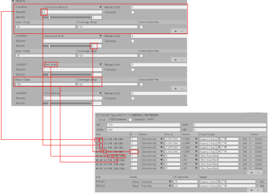
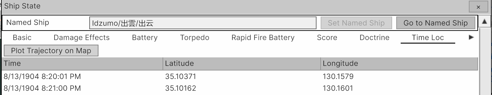
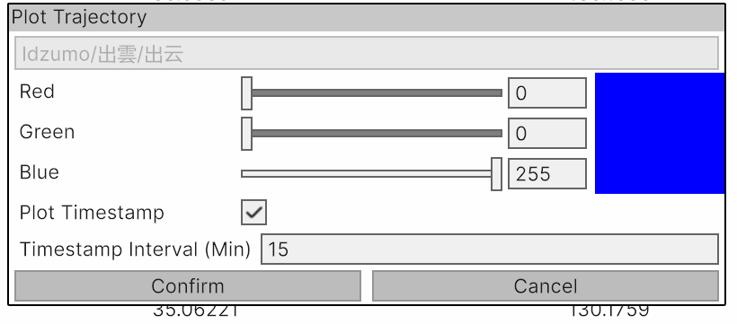
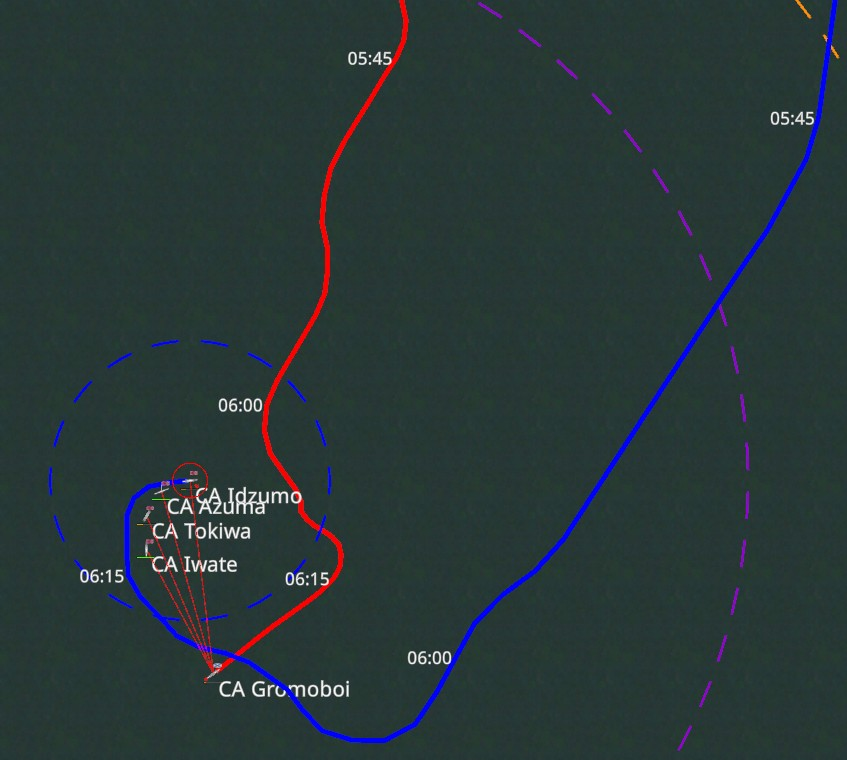
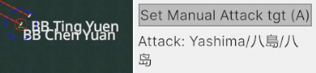
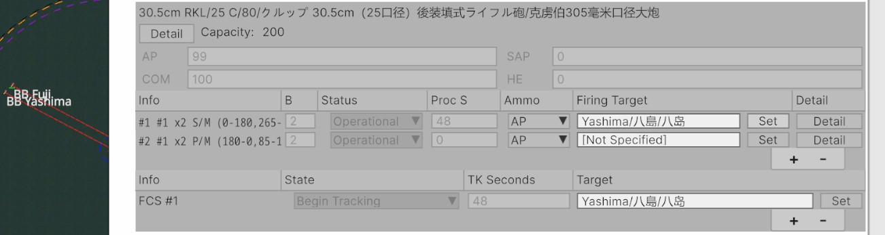
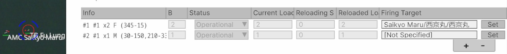
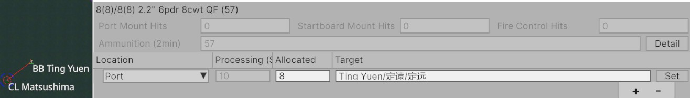
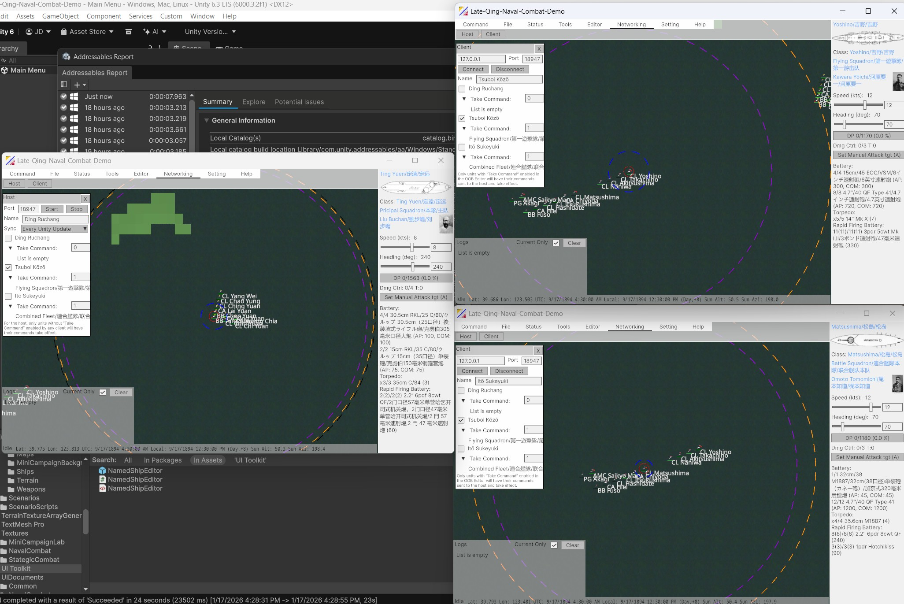

- Online (latest) version of this document: https://github.com/yiyuezhuo/First-Sino-Japanese-War-Manual
- Game Source: https://github.com/yiyuezhuo/Late-Qing-Naval-Combat-Demo
- Steam: https://store.steampowered.com/app/3996220/First_SinoJapanese_War/
- Discussion: https://discord.gg/2yqbyGwsdQ

# Naval Tactical Mode

## Range Lines

- Primary Battery Range: Black
- Secondary Battery Range: Orange
- First Rapid Battery Range: Purple
- Torpedo Range: Blue
- Visibility Range: Yellow

Note: Torpedo firing is based on an interception point solution; in a good firing position, the effective range is usually much longer than the range line listed above.
## Battery

Battery related resolution is based on SEEKRIEG 5 rule (though not always identical).  Reading this manual should be sufficient to understand the related mechanism; however, for further insight, it can be instructive to consult the original SK5 rulebook, though it is behind a paywall.

Ship State's items are based on the data in the Ship Class. The mapping relationship looks like this:

(FCS is mapped to "Fire Control Positions").

The target is set at the mount level. If Auto Firing is enabled (the default setting), the WTA Solver will guide the battery to fire at a target. The battery will then attempt to use the FCS and any valid mount (with a satisfied firing angle) to engage the target.

When an FCS tracks a unit, it increases its **TK Seconds (Tracking Seconds)** for that target. The tracking state will **upgrade** from "Begin Tracking" to "Tracking," resulting in a higher accuracy bonus. The FCS modifiers are as follows:

- Local Control (Target is not tracked by any FCS): Large negative modifier
- Begin Tracking: Small negative modifier
- Tracking: Neutral
- Hitting (Target was hit recently): Small Positive modifier

Similarly, a mount accumulates **Processing Seconds**. When the processing seconds reach the "seconds per round" value (determined by the Rate of Fire, which is based on the Penetration Table and range), the process seconds reset to 0, and a firing round is resolved.

The above image also show how the base fire control value is derived:

- The **Range Band** (determined by distance in the penetration table) and the **Target Aspect** determine the column.
- The **Target Speed** determines the row.

This fire control value is then adjusted by multiple factors:

- Visibility
- Evasive Action
- Fire Control System
- Over-centration
- Target Size
- Fire Control Radar (Although the game era doesn't cover radar (SK5 covered it), this value can be used to denote range-finder or other useful damageable device.)

The detailed rule can be checked in source code.

Note: Flying shell is not modeled in the game. The flying time is part of "processing time" in the game. 

### Hit Resolution

When a hit is scored, following procedure is performed:

- Roll for Hit Location & Vertical/Horizontal hit according Range Band (Short/Medium/Long/Extreme) and target aspect (Narrow/Broad).
- Compare Vertical/Horizontal penetration value (for given range) to effective armor value of the hit location. Three outcomes are possible:
	- Pass-Through: Less Effective
	- Penetrates And Detonates: Most Effective
	- Not Penetrate: Least Effective
- According to penetrate type, and use Ammo Type (AP/SAP/COM/HE), roll for Damage Effect and Damage Point inflicted.
- An increase in Damage Point may generate additional Damage Effects, or instant sink the ship if it become too high for a turn (but 100% DP doesn't automatically sink the ship). Damage Effect themselves may also generate further Damage Effects.

Note: "DE XXX" is the Damage Effect name used by SK5, the effect can be checked in source code or SK5 material (not always identical though).
## Torpedo

Torpedoes do not follow the SK5 rule, because the compromises made for tabletop play would result in a poorer system while not being any easier to implement compared to a system based on actual collision detection handled by the game engine’s physics.

### Ship Collider

To improve recognizability, the size of the icon/model could be increased in the settings (just like how miniature wargames often use oversized models). However, the real collider size is maintained. Internally in the game engine, it looks like this:

(The box represents the real collider. The LOS detection tool is based on the actual LOS, so it naturally handles curvature as well.)

### Interception Point

WIP

## Doctrine

A doctrine can be specified at any level of the OOB (at the Ship State level or at a higher, more abstract group level). If a lower-level unit's doctrine is not explicitly overridden, it inherits the doctrine value from its parent unit.

For the root group, if a doctrine is not **overridden**, a default value is used. Definitions of doctrines and their root default values are as follows:

- **Automatic Maneuver** (Default: **Manual**): Determines whether a unit’s maneuvering (desired heading and speed) is controlled by the AI.
- **Automatic Fire** (Default: **Automatic**): Determines whether a unit’s fire control (weapon targeting) is handled by the AI.
- **Ammunition Fallback** (Default: **True**): If a unit’s capacity for a given ammunition type is exhausted, a “closer” ammunition type is used instead (e.g., AP fallback chain: AP → SAP → COM → HE).
- **Ammunition Switch** (Default: **Automatic**): Determines whether the AI automatically switches a battery’s ammunition type to optimize effectiveness (e.g., using HE against unarmored targets and AP against heavily armored targets).
- **Max Fire Distance (200 mm+ Batteries)** (Default: **Not Specified**): If specified, batteries of 200 mm or larger will not fire at targets beyond the given range.
- **Max Fire Distance (100 mm–200 mm Batteries)** (Default: **Not Specified**): Same as above, but applies to 100 mm–200 mm batteries.
- **Max Fire Distance (<100 mm Batteries)** (Default: **Not Specified**): Same as above, but applies to rapid-fire batteries.
- **Max Fire Distance (Torpedoes)** (Default: **Not Specified**): Same as above, but applies to torpedoes.

## Plot Trajectory

Game historical trajectory can be plotted for ship. In the Ship State View's Time Loc Tabs, click the "Plot Trajectory On Map" button above the record table:

In the dialog, color and label can be configured:

Two plotted trajectory looks like this:

The trajectory will remain visible on the map until cleared using the "Clear Trajectories" button in the Tools Tab of the Top Tabs.

## Tutorial: Make a simple custom scenario

- Click "Start As Empty" in the main menu to create an empty scenario
- The "empty" scenario is not completely empty — two top groups Red and Blue, are created. You can check them in the Top tabs - Status - Order of Battle:

- Move camera to the area of interest
- Click the Insert button while the mouse is hovering on the map (not over the UI), and click on a point on the map. A dialog will appear:

There are three modes for inserting a ship:

- **Not Deployed Ship State**: Deploy a not deployed ship (the ship is usually created manually in the Ship State Editor). This is a somewhat advanced topic and is not covered in this tutorial.
- **Named Ship**: This create a Ship State from the selected Named Ship which is not associated with a Ship State (so that a Named Ship can only has a Ship State "embodiment") with proper initialization, and deploys it to map.
- **Ship Class**: This creates an "anonymous" Named Ship from the selected Ship Class and create a Ship State from that new Named Ship. It is used for hypothetical scenarios involving ship classes that exceed historical quantities. Some historical information from the built-in Named Ship is lost though.

Select Named Ship Yoshino (the first item in the Named Ship column), choose Blue in the "Attach to Group" Dropdown, and click the Confirm button. The historical Yoshino will be created on the map:

Click Insert again to open the insert dialog, you will notice Yoshino is no longer available in the Named Ship column. However it remains available in the Ship Class columns. Insert two more "anonymous" Yoshino by Ship Class method:

Select Yoshino1, click F or Follow button in the Top Tab and click on the Yoshino to set it to follow Yoshino. Then set Yoshino2 to follow Yoshino1. Set the desired speed of Yoshino (group leader) to 10 knots and heading to 90 degree (east). And click "Set to Formation Position" button in the Editor tab (if the button is not enabled, enable "Edit mode" in the Command tab). Position, speed and heading of ships would would be updated according to their formation relationships:

Now insert two other ships, set Attach to Group to Red and click "Set to Formation Position" to arrange them:

Switch to File Tabs, disable "Save without Streaming Asset" (required because some anonymous Named Ship were created) and click the "Save (Edit)" button to save the scenario:

Return to the main menu, click "Load Game" button to load the saved scenario to start to playing your new created custom scenario. 

## Weapon Target Assignment

### Automation Algorithm

In the default doctrine, every battery, torpedo, and rapid-firing battery on a ship would be arranged separately by the algorithm to reduce hostile potential firepower effectiveness. Thus following principle apply:

1. Fire Suppression: Deliver minimal firepower to enemy to create "under-fire" debuff to decrease their current fire projection.
2. Mission Kill: Prior to attack low-survivability platform with high available firepower.
3. Prevent Over-concentration: it is possible that some available batteries are not used.
4. Firepower stickiness: Firing platforms tend to remain engaged with the same target to avoid target-switching debuffs and to preserve visual coherence.

### Manual

#### Ship-Level

The ship-level manual attack target can be assigned via the information panel:

Click A or click the button and then click on the target. When the targeting is valid, "Attack: X" prompt would be displayed.

In the current implementation, this only restricts the automation algorithm's search space to prevent the ship from firing on other targets. However, the actual firing is not guaranteed, as the algorithm may deem the shot unfavorable due to the "over-concentration" penalty it introduces.
#### Mount-level

To manually perform mount-level targeting, auto-fire automation in the doctrine needs to be disabled. Otherwise automation will override manually specified value.
##### Battery

For a battery, both the mount and FCS's targets should to be set. Click the Set button and then click on a target:

If ammo need to be manually specified, related automation in the doctrine should be disable.

##### Torpedo

Torpedo is similar to battery:

##### Rapid Firing Battery

Click the "+" button to create a "targeting record", select port or starboard, then assign guns to the target. (In theory, every gun can target a different target, as there's no FCS Local Control penalty) 

## Multiplayer

The Naval Tactical Mode's WEGO mode can be played in multiplayer. The auto-playing multiplayer mode is not supported yet.

The host start a "room" and other client connect to the host. Each client can assign its own Take Command units, while the host commands remaining units. For example:

 In the above image, there are three game windows, the left one is the host. The right two on the right are clients connected to the host. The upper-right client takes command of the Flying Squadron, the lower-right client takes command of the Combined Fleet. As a result, the effective command partition is:

- Player Tsuboi Kōzō: Command the Flying Squadron
- Player: Itō Sukeyuki: Command the Combined Fleet excluding the Flying Squadron (since it's taken by Tsuboi Kōzō)
- Player Ding Ruchang: Command the Beiyang Fleet (or, equivalently, all force excluding the Combined Fleet taken by Itō Sukeyuki, which results in the only remaining force, Beiyang Fleet).

Note: This is a somewhat historically accurate setup. Tsuboi Kōzō, as a subordinate of Itō Sukeyuki, often executed his own commands when he believed them to be better, sometimes ignoring or misunderstanding Itō Sukeyuki orders.

### How to Set This Up:

- Player Ding Ruchang
	- Select a scenario
	- Click the Host button (Top Tabs - Networking - Host) to popup the Host dialog.
	- Click Start to begin hosting.
	- Change name to Ding Ruchang
- Player Tsuboi Kōzō:
	- Start as Empty
	- Click the Client button (Top Tabs - Networking - Client) to popup the Client dialog.
	- Enter the host's IP address and click Connect.
	- The client will receive a full synchronization from the host. So the scenario does not need to exist locally for the client.
	- Change name to Tsuboi Kōzō
	- Tsuboi Kōzō then open OOB Editor (via hyperlink in the information panel or Top Tabs - Status - Order of Battle)
	- Find Flying Squadron and toggle Take Command on:

- Player Itō Sukeyuki:
	- Similar procedure as Tsuboi Kōzō but different name and Take Command
	- The order of clients joining is interchangeable, but both should connect after the host has started.

### Turn Execution

To execute 1 WEGO step, the Host and all Clients with at least one Take Command unit must be in the Ready state before the game can advance. 

Normal advance command, such as hotkeys 1~9 (advance 1~9 minutes), the backquote key (advance 1 pulse) or the corresponding buttons, issued by client will send the client's commanded unit states to the host as a Merge Request. These states are merged into the host's state only when advancement is triggered; they are not applied immediately upon arrival.

Once a client submit a Merge Request, it is flagged as Ready, indicated by a checkmark in the corresponding checkbox (in the example above, the checkmark next to Tsuboi Kōzō indicates that he is ready). Before all players are ready, a ready client may still submit additional Merge Request to update his current command state.

For the host:

- If the host issues an advance command and is the last player to become ready, the advancement happens immediately for the specified timespan, after all client Merge Requests are merged into Host state. 
- If Host is not the last to become ready, the advancement occurs when the final client submit its Merge Request.

Depending on the synchronization mode, during advancement either:

- the full state is continuously sent from the host to all clients, or  
- the full state is sent only after advancement is completed.

Afterward, players observe the newly advanced turn, make new decisions, and mark themselves as ready again to advance to the next turn.
### Notes

- Default 1-minute turn (RTW style) may be too short for WEGO multiplayer gameplay. Miniatures wargames provide alternative approaches: Seekrieg uses 2-minutes turn, while the Admiralty Trilogy uses 3-minutes turn, although they sometimes also use 1-minute turn or 30--seconds turn. A 2-minutes or 3-minute turn can be used by having host advance the simulation using hotkey 2 or 3.
- Chat is not implemented yet. You can use external chat app like Discord.
- This traditional LAN networking can also be used over the internet with additional tools such as Hamachi.
- The game was not originally designed to support multiplayer, so the synchronization method is somewhat clumsy. Technically, I use overly coarse-grained commands for synchronization instead of breaking them into many smaller command, which significantly slows the game and imposes heavy traffic burden. As a result, continues-time multiplayer (similar to JTS Naval Campaign) is not implemented yet. However I may revisit this issue after completing other higher-priority work.
# Strategic Mode

## Strategic Group & Land Unit

WIP

## Movement

WIP

## Supply

WIP

## Naval Transfer

Navy Transfer must be carried out through a naval mission. The Non-Fleet Strategic Groups to be transported via Navy Transfer and the Fleet Group providing the transportation need to be assigned to the mission. During the assembly phase, they will arrive at the assembly point (the first hex of the waypoint). The groups to be transported are generally divided into several parts and loaded onto individual; transport ships, with large formation gradually being emptied until they become small enough to be entirely loaded onto a single transport ship. Upon reaching the destination, the groups will, by default, automatically reorganize into their original formation. The navy transfer may require multiple rounds trips. Once the mission is completed, the transport fleet will remain stationed at the assembly point (it's a good start point for a persistent supply mission).

## Repair

The repair system is inspired by WITP (War in the Pacific). Specifically, damage from SK5 is mapped to a simplified WITP repair model for resolution. (Sample mapping: 1 SK5 Flooding Hit ≈ 20 WITP Flooding Damage Points, or 20% flooding.)
### Tactical Naval Combat damage effect Trim

When a ship’s state is synced to the strategic game, certain adjustments are applied to damage effects. Non-permanent and some specific damage effects are removed.

### Repairable damage

Following state could be counted as a damage:

For example, each max speed offset is counted as separate damage and can be repaired individually to restore the ship's original speed.

Different damage types have different repair point costs and priorities, and are classified as either normal damage or major damage. Major damage can only be repaired by a repair provider that meets the displacement requirement.

### Repair Device

Damage can be repaired by ports and repair shipyards.

| Type | Repair Point Generated | Repair Upper Limit (tons) |
| ---- | ---------------------- | ------------------------- |
| Port (per level) | 100 | 0 |
| Repair Shipyard (per level) | 100 | 1000 |

Repair ships have been added to the game, but their repair functionality will be implemented in a future update.

### Mapped Damage Point

In the SK5 system, the Taken Damage Point for an unsunk ship is sometimes a _good thing_, since a high damage point indicates that the ship’s “instant-kill potential” has been expended—for example, its magazine has been destroyed relatively safely. Therefore, damage points are not listed as a repairable item in the repair system. Instead, they are _forcibly_ restored according to the ratio of the repaired damage’s repair cost to the ship’s total existing repair cost. The forcibly removed damage points are called **“mapped damage points”** in the log.

## Command Structure

Each strategic group has a command point value cost:

- Each land unit under the command will cost the original value.
- Each strategic group under the command will cost 1/3 of its own command point.

Strategic group have a fixed command capacity of 1500. If command point cost is lower than the capacity, the group will be subject to a constant penalty based on commander's Land Operational ability:

| Level | Command Penalty | Tactical Modifier |
| ----- | --------------- | ---------------- |
| Barely Competent | 40% | -10% |
| Average (Unknown) | 30% | 0% |
| Above Average | 20% | 10% |
| Outstanding | 10% | 20% |
| Gifted | 0% | 30% |

In the land battle resolution, a unit's "Chance Cost" (basically cost to "activate" this unit) is modified by every layer of engaged commanding layer:

In the above example, if the 9th Combined Bridge is the leading group (If only 1 independent group is engaged, that group is the leading group. If more than one group is engaged in the land battle, weaker groups would attached to the strongest group temporarily. So there's still only 1 group on the top and other attached group will be subject to extra command layer penalty.). This layer will yield a command penalty of 20% since command point is lower than capacity and commander's Land Operational ability is "above average". On the other hand, 11th Inf Regt layer will generate 32% penalty. So 2nd Bn, 11th Inf Regt and 3rd Bn, 11th Inf Regt would be subject to 52% penalty.

If 5th Div is engaged instead of 9th Combined Bridge, the penalty would be stacked with an extra layer introduced by extra command layer.

This design achieves the following effects:

- Bigger land units are hard to activate, so it's less-effective than smaller unit, that's how I implement the "soft combat width".
- Every engaged operational commander in the commander chain make proper effect, instead of strange positive buf stack by enforced layer (EX: HOI) or just no effect on higher layer (EX: ATG).

The penalty system is designed to mathematically ensure that "flatter" command structures generally incur higher penalties. Thus, Japan's modernized hierarchical command structure will typically perform better than China's pre-Napoleonic structure, which lacked permanent formations above the battalion level.

The tactical modifier, however, only affects directly commanded land units and does not apply through the hierarchy.

## Land Battle Resolution

### Sub Combat

Each turn, every unit generates a "chance" value representing its tactical potential. Two chance values would be consumed in a sequence of generated sub-combat for this turn.

For each sub-combat, the two sides roll with their total chance as weight to determine the initiative side. The initiative side becomes the attacker of the sub-combat, while the opposing side becomes the defender. An attacker unit is rolled according to the power weighting and a defender unit is selected based on strength weighting (so low-effective unit -- those with high suppression, fatigue and low morale) would be more likely to be chosen defender than attacker in sub-combat.

The two engaged units then determine their commitment percentage, which is based on a "reference ratio" (e.g., a 300-man unit attacking a 100-man unit with a 1:1 reference ratio would result in the attacker committing 100 men and the defender committing 100 men). The determination of the reference ratio is heavily influenced by the current situation value, which represents the loss or gain of critical advantageous positions. The situation only shifts when the attacker in the sub-combat achieves a significant advantage by the end of the sub-combat (attacker is not suppressed, defender is suppressed, attacker has higher morale and lower fatigue). This represents a tactical breakthrough that may force the defender to retreat from their current position. Conversely, if the defender achieves a "victory," the situation does not shift, aside from potentially a favorable attrition ratio.

Generating a sub-combat consumes chance from the initiative side based on the unit's state and its commitment percentage.

In an execution of land battle, which may last several turns, the side with the advantage gradually pushes the situation in its favor, gaining increasingly better exchange ratios. The disadvantaged side may launch counterattacks to retake the situation, but may ultimately be unable to sustain the deteriorating exchange ratio and choose to retreat from the hex. They may then retreat to a new hex and start a new battle, where the situation resets — allowing this cycle to potentially repeat.

Thus, sub-combats give the initiative side an upper hand, and having more initiative is almost always beneficial. This can be achieved by:

- More units — generates higher base chance values.
- A more effective command structure and higher commander ability — reduces the chance cost for each sub-combat generated.

For the resolution of a land battle within a single strategic turn (hour), chance is only consumed up to a given percentage (e.g., 90%) before the resolution ends. This threshold can be adjusted to control battle intensity.

### Abstract Firing

A sub combat is consisted of 3 firing exchange. Each firing inflict strength, suppression, morale and fatigue hit. Two side also increase some fatigue.

The 3 non-"physical" effectiveness attribute, suppression, morale and fatigue is defined as:

- Suppression: An effect is somewhat longer than true "fire suppression", but even it's 100% suppressed, most of the value would be restored in the new turn (not 100% is due to some suppression is assumed to happen in the end of last turn). 
- Morale: morale is like suppression, but slower to restore and harder to inflict.
- Fatigue: fatigue is like morale, but slower to restore and harder to inflict. And some fatigue would be imposed without loss.

These value with strength modify the "lethality" (a concept taken from JTS Squad Battle), which effect inflict hits and if a "breakthrough" (situation push) is achieved.

# FAQ

## Localization Quality Issues?

The base development language is English, which remains the most polished version. If you encounter questionable translations in other languages, please verify against the English version first.

Current localization approach:

- **Basic UI**: English and Simplified Chinese versions are manually crafted. Japanese and Traditional Chinese are LLM-translated based on the above two languages.
- **Remarks**: Source content with its orignal language appears at the top; translation follow below.
- **Long Texts** (Help, tutorials, Steam page, etc.): English version are manually written; other languages are LLM-translated from English.
- **Dynamic Content** (Damage effects, combat logs, etc.): Similar to Basic UI.

## Why Don’t Ships Sink Immediately After Reaching 100% Damage Points?

In the SK5 system, reaching 100% Damage Points (DP) does not guarantee a ship will sink. A vessel might survive well beyond 100% DP — or sink instantly from the first hit.

DP primarily drives the generation of General Damage Effects, which can severely impair a ship’s combat capability. The 100% DP mark indicates a high probability that the ship becomes mission-killed (combat ineffective).

Mechanically, 100% DP marks the point at which General Damage Effect checks cease. Beyond this threshold, no further General DE rolls are made, meaning that additional damage is relatively less likely to cause the ship to sink via general damage (you can think of this as the chance of catastrophic explosions, such as magazine detonations, having already been exhausted, so further shell holes above the waterline no longer increase the likelihood of sinking). That said, specific damage effects resulting from normal hits can still sink the ship.

## How to Enable Movement AI

Select a group in the OOB Editor, turn off "Inherited" in the automatic movement field, and set it to "Automatic." The group will then change its course according to certain principles. This setting is usually applied to a top-level group, such as "Japan Fleet" or "China Fleet," but it can also be set at a subordinate level for partial automation.

The AI is still in a development state, so it is not enabled by default. The game currently recommends sandbox-style gameplay, where the player controls both sides simultaneously and observes the outcome—similar to how solitary wargamer does play their miniatures, but with help of auto-resolution powered by computer.

## Editing is Not Intuitive

I haven’t written related material since major rework is expected. If you really want to edit something and find it frustrating, contact me (via GitHub issue or Discord server) to let me know someone is really interested, I would write a temp document to explain how to do it in the current stage.

## Why are so many standard UI elements named "Editor"? I don't want to "edit" anything—I just want to play.

I aim to recreate a sandbox experience similar to Vassal and Tabletop Simulator (TTS), where editing allows players to introduce custom rules and house rules without coding. On the other hand, in games like CMO, players often use edit mode to streamline experimentation—a feature I want to incorporate into game.

## Why is so much image loading done at runtime?

I want to emulate Tabletop Simulator's approach of loading images dynamically during gameplay, which has both advantages and disadvantages.

## Why Is the Game So Large? Shouldn't It Be a Mini Game liek RTW Given the "Minimalist" Graphics?

Similar to games like CMO, the majority of the installation size comes from GIS elevation data. While titles such as Rule the Wave avoid this overhead by using vector data, this project uses raster data — even though ocean depth data has been clamped.

The reason for retaining elevation data is to support a planned tactical land combat generator, which will utilize terrain elevation in future updates. Also elevation data will render location more recognizable and map pretty.

## Is the Strategic Game Playable Now?

No, only the naval tactical game is currently partial playable. The exposed strategic game mode only gives a *feel* for what the full strategic experience will eventually be like. 

This area may also be of interest to open-source contributors, as the strategic game is now the main focus of development.

## What is DE XXX (like DE 101?)

DE XXX is "Damage Effect XXX" listed in SK5, though I can't list them since they're behind a paywall, you can check source code to determine their effect in this game. They're not always equivalent.

# Help

## Getting Started

- Right-click and drag to move the camera, use the scroll wheel to adjust the zoom level.
- Press 1 to advance by 1 minute (mouse should be in the map instead ui area)
- Control group leader (icon with a direction arrow) to control a group
	- Change direction: Select a group lead, then hold Shift and left-click a point on the map to set the direction.
    - Change speed: Change value in the slider of right panel
    - Change or inspect a lot of details in editors.
- Use F or R to set Follow and relative to relationship, more parameter can be specified in the ShipLog editor.

## Automation

- By default, firing is automated, following a somewhat optimal rule, and can be configured in the editor, ranging from doctrine to manual target specification.
- If a unit follow or is relative to a target, it will adjust its speed and course to reach the desired position.
- By default, an independent unit (usually the group leader) maintains its current speed and course. However, if automatic movement is enabled in the doctrine, the unit will adjust its course to maximize firepower while minimizing incoming damage.

## Shortcuts

Basic:

- Left Click: Select Unit
- Right Click: Select Unit and open Ship State Editor for it.
- Shift + Left Click: Set course for the selected unit
- D: Distance measureing line
- S: Line of Sight (check ship masking & Earth curvature)
- I: Detach unit (set control mode to Independent)
- F: Set follow target (extra parameter requires Ship State editor)
- R: Set relative to target (extra parameter requires Ship State editor)
- L: Open Ship State Editor for the selected ship
- Esc: Reset UI to idle state.

Edit:

- Insert: Insert a ShipLog on map. (Deploy a "non-deployed" ship to map).
- Delete: Delete selected ship.
- M: Move selected ship to another point.
