- Online (latest) version of this document: https://github.com/yiyuezhuo/First-Sino-Japanese-War-Manual
- Game Source: https://github.com/yiyuezhuo/Late-Qing-Naval-Combat-Demo
- Steam: https://store.steampowered.com/app/3996220/First_SinoJapanese_War/
- Discussion: https://discord.gg/2yqbyGwsdQ

# Naval Tactical Mode

## Formation Control

Control is the basic way to make several ships behave like a formation. A ship may sail independently, follow another ship, or hold a relative station from another ship. Once the relationship is set, the controlled ship keeps adjusting its own course and speed toward the required station during time advance.

Select the ship you want to command first. The control buttons are in the top **Command** tab, and the same low-level commands also have keyboard shortcuts.

### Low-Level Control

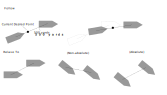

- **Follow (F):** select a ship, press **F** or click **Follow**, then left-click the ship it should follow. The following ship will try to stay astern of the target at its **Follow Distance**. This is the usual tool for a simple line-ahead column. The distance can be adjusted in the Ship State View; the default is 500 yards.
- **Relative To (R):** select a ship, press **R** or click **Relative**, then left-click the ship used as the reference. The selected ship will move to a fixed bearing and distance from that reference ship, and will match the reference ship's heading when it reaches station. In the Ship State View, **Relative To Dist** sets the distance, **Relative To Azimuth** sets the bearing, and **Absolute** decides how the bearing is read. With **Absolute** off, the bearing turns with the reference ship; with **Absolute** on, the bearing is a true map bearing. The default station is 250 yards at 135 degrees, roughly off the target's starboard quarter.
- **Detach (I):** sets the selected ship to **Independent**. It clears the current Follow or Relative To relationship, so the ship keeps its own movement orders again.

The game blocks obvious bad links, such as a control loop or a link between ships from different root formations. If a followed or referenced ship becomes invalid, the controlled ship is treated as independent for movement.

### High-Level Control

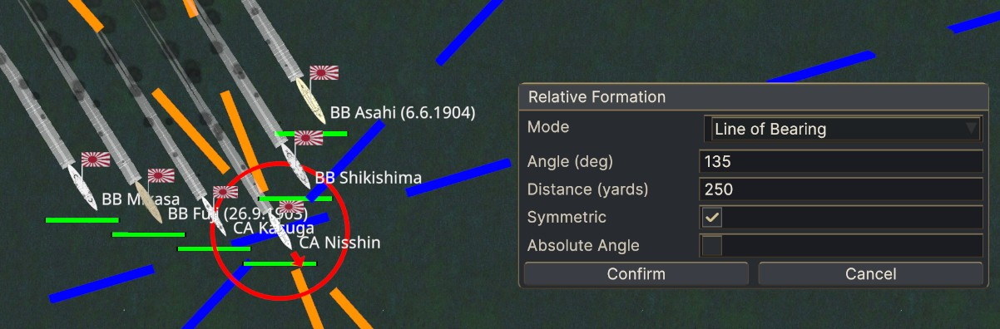

High-level control buttons rewrite the control relationships below the currently selected anchor ship. They are basically batched low-level control, useful for changing from one tactical shape to another.

- **Set Formation to Relative:** opens the **Relative Formation** dialog and converts the ships under the selected anchor into Relative To links.
  - **Keep Current Position** records the present spacing and bearing as the new formation station. It's usually used to do **Turn together** maneuver.
  - **Line Abreast** gives a beam formation; the dialog sets the angle to 90 degrees by default.
  - **Line Of Bearing** gives a diagonal line; the dialog sets the angle to 135 degrees by default.
  - **Distance** and **Angle** set the spacing and bearing. **Symmetric** alternates ships to both sides of the anchor, useful for screens. **Absolute** makes the bearing fixed to the map; leaving it off makes the formation rotate with the anchor's heading.
- **Set Formation to Follow Chain:** opens the **Follow Chain Formation** dialog. After confirming the follow distance, the ships below the selected anchor are flattened into a single chain: anchor, first follower, next follower, and so on. Each ship follows the one immediately ahead of it. This is the quickest way to restore a column.
- **Reverse Control Chain:** reverses a clean single control chain. Select the independent ship at the head of the chain, then click the button. The last ship becomes independent, and the former leaders become followers behind it. This is handy when a column needs to turn back along its own track. The command only works on a simple one-child-at-each-step chain; if a ship controls multiple ships, the game will ask you to simplify the chain first.

## Waypoint Movement

Waypoint is a movement aid for steering ships along a plotted route. It is separate from formation control: only an **Independent** deployed ship follows its manual route.

Select a ship, then click **Waypoint (W)** in the top command bar or press **W**. Entering waypoint mode clears that ship's old manual route and asks you to choose a destination. Left-click commits the previewed segment and appends its points to the ship's route. Press **W** again to leave waypoint mode.

During time advance, the route updates the ship's desired heading:

1. Reached waypoints are removed when the ship is within 50 yards of the leading waypoint.
2. If the ship has passed a corner, the leading waypoint is also removed. A corner counts as passed when the ship is close to the following leg or is clearly closer to the next waypoint than to the leading waypoint.
3. If only one waypoint remains, the desired heading points directly at it.
4. If several waypoints remain, the game projects the route into local yards around the ship, finds the closest point on the route, then chooses a lookahead point further along it. The lookahead distance is based on speed and clamped between 100 and 600 yards.
5. The ship's desired heading is set toward that lookahead point, so it tends to follow a smooth route instead of aiming only at the next corner.

## Range Lines

- Primary Battery Range: Black
- Secondary Battery Range: Orange
- First Rapid Battery Range: Purple
- Torpedo Range: Blue
- Visibility Range: Yellow

Note: Torpedo firing is based on an interception point solution; in a good firing position, the effective range is usually much longer than the range line listed above.
## Battery

Battery related resolution is based on SEEKRIEG 5 rule (though not always identical).  Reading this manual should be sufficient to understand the related mechanism; however, for further insight, it can be instructive to consult the original SK5 rulebook, though it is behind a paywall.

Ship State's items are based on the data in the Ship Class. The mapping relationship looks like this:

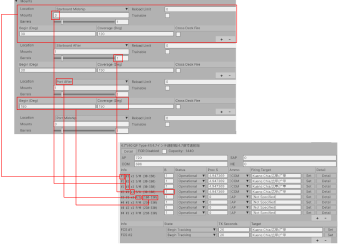
(FCS is mapped to "Fire Control Positions").

The target is set at the mount level. If Auto Firing is enabled (the default setting), the WTA Solver will guide the battery to fire at a target. The battery will then attempt to use the FCS and any valid mount (with a satisfied firing angle) to engage the target.

When an FCS tracks a unit, it increases its **TK Seconds (Tracking Seconds)** for that target. The tracking state will **upgrade** from "Begin Tracking" to "Tracking," resulting in a higher accuracy bonus. The FCS modifiers are as follows:

- Local Control (Target is not tracked by any FCS): Large negative modifier
- Begin Tracking: Small negative modifier
- Tracking: Neutral
- Hitting (Target was hit recently): Small Positive modifier

Similarly, a mount accumulates **Processing Seconds**. When the processing seconds reach the "seconds per round" value (determined by the Rate of Fire, which is based on the Penetration Table and range), the process seconds reset to 0, and a firing round is resolved.

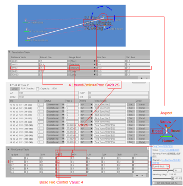

The above image also show how the base fire control value is derived:

- The **Range Band** (determined by distance in the penetration table) and the **Target Aspect** determine the column.
- The **Target Speed** determines the row.

This fire control value is then adjusted in the following order. Unless noted otherwise, these are additive modifiers to the fire control score.

- **Close Range Override:** at 4,500 yards or less, and only if the shot is in the **Short** range band, the game compares the normal table value with the close-range table below and uses the higher of the two.

| Target Speed (knots) | 0-2,000 yd Broad | 0-2,000 yd Narrow | 2,001-4,500 yd Broad | 2,001-4,500 yd Narrow |
| -------------------- | ---------------: | ----------------: | -------------------: | --------------------: |
| 0-9                  |               15 |                12 |                   12 |                    10 |
| 10-18                |               13 |                 9 |                   10 |                     8 |
| 19-27                |               11 |                 8 |                    9 |                     7 |
| 28-36                |                9 |                 7 |                    8 |                     6 |
| 37+                  |                8 |                 6 |                    7 |                     5 |

- **Mount and Battery Condition:** damage and sub-states are applied before the environmental and tactical modifiers. The actual calculation is:

`Adjusted FC = max((Base FC + total flat offsets + worst directional offset) × lowest coefficient, 0)`

Flat offsets from applicable sub-states are summed. If several coefficient penalties are present, the lowest coefficient is used. Directional penalties are taken from the worst applicable directional modifier. In the current implementation, the existing sector fire/smoke directional interference effect is usually a `-1` penalty when that damaged/smoke-filled section interferes with the mount and firing direction.

- **Visibility:** the current scenario visibility always applies.

| Visibility State                                 | Modifier |
| ------------------------------------------------ | -------: |
| `VeryClear1`, `VeryClear2`, `ExceptionallyClear` |       +1 |
| `LightHaze`, `Clear`                             |       +0 |
| `ThinFog`, `Haze`                                |       -2 |
| `LightFog`, `DenseFog`                           |       -4 |

- **Twilight, Night, and Illumination:**
  - At **twilight**, if the target lies within `30°` of the sun bearing from the observer, the target is treated as silhouetted and receives `+1`.
  - At **twilight**, if the target lies within `30°` of the opposite bearing, the target is treated as lost in darkness and receives `-2`.
  - Otherwise, twilight gives `+0`.
  - At **night**, if no positive illumination bonus applies, the moonlight modifier is `-2` with moonlight and `-4` without moonlight.
  - A target that is **afire** or **illuminated by searchlight** receives `+2`.
  - A target merely **using searchlight** receives `+1`.
  - If a positive illumination bonus applies, the twilight and moonlight modifiers are skipped.

- **Evasive Action:**

| Condition | Modifier |
| --- | ---: |
| Target only is evasive | -3 |
| Firing ship only is evasive | -2 |
| Both ships are evasive | -8 |
| Neither ship is evasive | +0 |

- **Fire Control System State:**
  - If **no operational FCS** is tracking the target, the battery fires under **Local Control** and the fire control score is multiplied by `0.5`.
  - Otherwise, if at least one tracking FCS is in **Hitting**, the modifier is `+2`.
  - Otherwise, if at least one tracking FCS is only in **Begin Tracking**, the modifier is `-2`.
  - Otherwise, the battery is in ordinary **Tracking** and receives `+0`.

- **Under Fire and Over-Concentration:**
  - If the firing ship has been fired upon by **3 or more ships** during the current turn, it receives `-2`.
  - Over-concentration is `0` for the first battery firing at a target, `-1` for the second, `-2` for the third, and so on.
  - In formula form: `-(number of batteries already firing at the target - 1)`, but never above `0`.

- **Target Size:** the target ship's **Target Size modifier** is added directly. If a ship class uses the default displacement-derived value, the bands are:

| Displacement | Target Size Modifier |
| --- | ---: |
| 0-671.5 tons | -1 |
| 671.6-3,110 tons | 0 |
| 3,110.1-16,660 tons | +1 |
| Above 16,660 tons | +2 |

- **Battle Factors:**
  - **Sea State:** Beaufort `0-3` gives `0`. Beaufort `4+` uses the following reduction table by firing ship displacement. A result of `-100` means fire is effectively blocked.

| Ship Displacement (tons) | Bft 4 | Bft 5 | Bft 6 | Bft 7 | Bft 8 | Bft 9 | Bft 10 |
| ------------------------ | ----: | ----: | ----: | ----: | ----: | ----: | -----: |
| 0-100                    |    -2 |    -4 |    -6 |  -100 |  -100 |  -100 |   -100 |
| 101-200                  |    -1 |    -3 |    -4 |    -5 |    -7 |  -100 |   -100 |
| 201-300                  |    -1 |    -2 |    -3 |    -5 |    -6 |  -100 |   -100 |
| 301-400                  |     0 |    -2 |    -3 |    -4 |    -5 |    -9 |   -100 |
| 401-500                  |     0 |    -2 |    -3 |    -4 |    -5 |    -7 |   -100 |
| 501-600                  |     0 |    -1 |    -2 |    -3 |    -4 |    -6 |   -100 |
| 601-700                  |     0 |    -1 |    -2 |    -3 |    -4 |    -5 |   -100 |
| 701-800                  |     0 |    -1 |    -2 |    -3 |    -3 |    -5 |   -100 |
| 801-1,000                |     0 |    -1 |    -2 |    -2 |    -3 |    -5 |   -100 |
| 1,001-1,200              |     0 |    -1 |    -2 |    -2 |    -3 |    -4 |     -9 |
| 1,201-1,500              |     0 |    -1 |    -1 |    -2 |    -2 |    -4 |     -8 |
| 1,501-1,900              |     0 |    -1 |    -1 |    -2 |    -2 |    -3 |     -7 |
| 1,901-2,500              |     0 |     0 |    -1 |    -2 |    -2 |    -3 |     -7 |
| 2,501-3,500              |     0 |     0 |    -1 |    -1 |    -2 |    -2 |     -6 |
| 3,501-5,000+             |     0 |     0 |    -1 |    -1 |    -2 |    -2 |     -6 |

  - **Crew Quality:** the firing ship's current Crew Quality value is added directly.
  - **Leader Naval Tactical:** if the leader-rule variant is enabled, the commander's Naval Tactical rating adds:

| Naval Tactical Rating |             Modifier |
| --------------------- | -------------------: |
| Gifted                |                 +0.3 |
| Outstanding           |                 +0.2 |
| AboveAverage          |                 +0.1 |
| Average               |                    0 |
| BarelyCompetent       |                 -0.1 |
| Unknown               | treated as `Average` |

- **Fire Control Radar:** if the battery has operational fire control radar, the battery's own **Fire Control Radar Modifier** is added directly.

The final fire control score is then converted into hit probability. For this step, the score is capped to the range `0-30`.

| Final Fire Control Score | Hit Probability           |
| ------------------------ | ------------------------- |
| 0-3                      | `0.25% + 0.25% × score`   |
| Above 3 up to 19         | `1% + 0.5% × (score - 3)` |
| Above 19 up to 30        | `9% + 1% × (score - 19)`  |

After that, the game's **Global Hit Coefficient** is applied to the result. In the default setting, this coefficient is `1.0`.

At present, blind fire, smoke-obscuration penalties, spotter aircraft bonuses, and barrage-specific extra concentration penalties are not yet applied in this calculation.

Note: Flying shell is not modeled in the game. The flying time is part of "processing time" in the game. 

### Hit Resolution

When a shell is ready to fire, one round of ammunition is spent and the final hit probability described above is rolled. If the roll misses, only a firing log is recorded. If the roll hits, the game resolves the hit by target damage schema: **Warship**, **Merchant Vessel**, or **Land Battery**.

For a **Warship**, the game first rolls a hit location. The column is determined by range band; **Long** and **Extreme** use the same location column.

Broad target aspect:

| Hit Location | Short | Medium | Long/Extreme |
| --- | ---: | ---: | ---: |
| Deck, horizontal | 2 | 12 | 25 |
| Turret, horizontal | 1 | 3 | 6 |
| Superstructure, horizontal | 2 | 4 | 8 |
| Conning Tower, vertical | 4 | 3 | 3 |
| Main Belt, vertical | 26 | 18 | 16 |
| Belt Ends, vertical | 9 | 8 | 7 |
| Barbette, vertical | 19 | 17 | 11 |
| Turret, vertical | 17 | 16 | 11 |
| Superstructure, vertical | 19 | 17 | 12 |
| Ineffective | 1 | 1 | 1 |

Narrow target aspect:

| Hit Location               | Short | Medium | Long/Extreme |
| -------------------------- | ----: | -----: | -----------: |
| Deck, horizontal           |     4 |     20 |           34 |
| Turret, horizontal         |     2 |      3 |            7 |
| Superstructure, horizontal |     3 |      9 |           14 |
| Conning Tower, vertical    |     6 |      4 |            3 |
| Main Belt, vertical        |     7 |      5 |            5 |
| Belt Ends, vertical        |     4 |      3 |            3 |
| Barbette, vertical         |    28 |     16 |            6 |
| Turret, vertical           |    23 |     19 |           13 |
| Superstructure, vertical   |    22 |     20 |           14 |
| Ineffective                |     1 |      1 |            1 |

These numbers are weights of sampling. If **Ineffective** is rolled, the shell scores a hit but produces no armor penetration or damage result.

For a **Land Battery**, the hit location table is simpler:

| Range Band | Horizontal | Vertical | Ineffective |
| --- | ---: | ---: | ---: |
| Short | 5 | 94 | 1 |
| Medium | 10 | 89 | 1 |
| Long/Extreme | 20 | 79 | 1 |

For a **Merchant Vessel**, armor location is not used. The game rolls:

| Merchant Hit Location | Weight |
| --- | ---: |
| Superstructure | 8 |
| Propulsion | 12 |
| Cargo Area 1 | 20 |
| Cargo Area 2 | 20 |
| Cargo Area 3 | 20 |
| Cargo Area 4 | 20 |

After the hit location is known, the game selects either the vertical or horizontal penetration value from the firing battery's penetration table. Warships and land batteries use the armor location to choose the penetration type:

| Location | Penetration Type Used |
| --- | --- |
| Deck | Horizontal |
| Turret, horizontal | Horizontal |
| Superstructure, horizontal | Horizontal |
| Conning Tower | Vertical |
| Main Belt | Vertical |
| Belt Ends | Vertical |
| Barbette | Vertical |
| Turret, vertical | Vertical |
| Superstructure, vertical | Vertical |

The penetration value is then adjusted for the ammunition actually fired:

| Base Penetration Type | Fired Ammunition | Effective Penetration |
| --- | --- | --- |
| Same as fired ammunition | Same type | 100% of table value |
| AP table | SAP | 75% of table value |
| AP table | Common | 50% of table value |
| SAP table | Common | 66% of table value |
| Any table | HE | Uses the special HE penetration lookup by shell bore and AP-equivalent penetration |
| Other combinations | Any | 100% of table value |

The target's effective armor is read from the hit location. An armor value of `0.5 inch` or less is treated as **unarmored** for shell detonation purposes.

The game then resolves the hit into one of three penetration/detonation classes:

| Condition                                                            | Result                                                                          |
| -------------------------------------------------------------------- | ------------------------------------------------------------------------------- |
| Armored target, penetration at least armor but less than twice armor | Class A, Penetrates and Detonates                                               |
| Unarmored target, or penetration at least twice armor                | Roll for detonation; success gives Class A, failure gives Class B, Pass-Through |
| Armored target, effective penetration less than effective armor      | Class C, No Penetration                                                         |

The detonation roll uses the fired ammunition:

| Ammunition | Armored Detonation Chance | Unarmored Detonation Chance |
| --- | ---: | ---: |
| AP | 30% | 20% |
| SAP | 50% | 40% |
| Common | 70% | 70% |
| HE | 90% | 90% |

Merchant vessels are resolved as unarmored targets with nominal penetration `1` and armor `0`.

Damage Points and Damage Effect probability come from the firing battery's **Damage Rating** row in the Shell Damage Factors table. The game uses the highest table row whose Damage Factor is less than or equal to the battery's Damage Rating.

Given penetration type (class A/B/C) hit and ammunition type (AP/SAP/Common/HE), damage rating, a damage point is rolled and inflicted and a damage effect is rolled. In general:

- Class A > Class B > Class C
- (If class A) HE > Common > SAP > AP
- Higher damage rating => higher damage point & higher probability to add a damage effect

Detail can be seen in [source](https://github.com/yiyuezhuo/Late-Qing-Naval-Combat-Demo/blob/20167d97b11e08761cd2355c79570feb69433288/Assets/Scripts/NavalCombatCore/RuleChart.cs#L428)

Damage Points are accumulated as pending damage during the turn and then applied during damage resolution. When a ship crosses damage tiers, the game may generate extra general Damage Effects and may trigger morale or catastrophic sinking checks.

| Damage Tier | Damage Percent Threshold | Chance to Generate General DE When Crossed |
| ----------- | -----------------------: | -----------------------------------------: |
| 0           |                       0% |                                         0% |
| 1           |                      10% |                                        70% |
| 2           |                      20% |                                        80% |
| 3           |                      30% |                                        75% |
| 4           |                      40% |                                        85% |
| 5           |                      50% |                                        80% |
| 6           |                      59% |                                        90% |
| 7           |                      68% |                                        85% |
| 8           |                      77% |                                        95% |
| 9           |                      86% |                                        90% |
| 10          |                      95% |                                       100% |
| 10          |                     101% |                                       100% |

Morale checks are made when crossing tiers 7-10:

| Crossed Tier | Crew Rating -1 | Crew Rating 0 or +1 | Crew Rating +2 | Crew Rating +3 |
| ------------ | -------------: | ------------------: | -------------: | -------------: |
| 7            |            12% |                  8% |             4% |             4% |
| 8            |            24% |                 16% |            10% |             4% |
| 9            |            36% |                 24% |            15% |             8% |
| 10           |            48% |                 32% |            20% |            15% |

If a ship crosses **8 or more damage-tier rows in a single turn**, it is destroyed by catastrophic damage. Separately, if flooded machinery spaces reach the current survival threshold, the ship is also destroyed by flooding. Reaching 100% Damage Points by itself does not automatically sink a ship unless one of these checks or a Damage Effect produces that result.

Note: "DE XXX" is the Damage Effect name used by SK5. The in-game effect behavior is implemented in code and may not be identical to SK5 in every case.
## Torpedo

Torpedoes do not follow the SK5 rule, because the compromises made for tabletop play would result in a poorer system while not being any easier to implement compared to a system based on actual collision detection handled by the game engine’s physics.

### Ship Collider

To improve recognizability, the size of the icon/model could be increased in the settings (just like how miniature wargames often use oversized models). However, the real collider size is maintained. Internally in the game engine, it looks like this:

(The box represents the real collider. The LOS detection tool is based on the actual LOS, so it naturally handles curvature as well.)

### Interception Point

Torpedo firing is solved against an interception point rather than against the target's current position. For each available torpedo speed/range setting, the game checks whether a valid interception solution exists and whether the interception distance is still within that setting's range. If multiple settings are valid, the game prefers the one with the shortest interception distance.

In practice, this means:

- A target that is crossing your bow or moving toward the predicted interception area is usually easier to attack than one running directly away.
- The relevant range is the distance to the interception point, not simply the current straight-line distance to the target.
- A shot can still be blocked even if the target looks close enough, because the mount must also have the correct firing arc, a loaded torpedo, and a doctrine-permitted firing distance.

Before launching, the game also performs a torpedo safety check. If the projected shot is considered unsafe, the mount will not fire even if a mathematical interception solution exists.

After launch, the torpedo becomes a real moving object on the map. It can:

- hit a ship by physical collision,
- run out of range,
- hit land and self-destruct,
- or become a dud.

If torpedo reloading is enabled in the preference, reloading is handled per mount. If the mount has reload allowance and magazine torpedoes remaining, one reload cycle takes 360 seconds.

The current build also includes a Torpedo Intercept Solution Visualizer in the top tabs. It is useful for diagnosing why a torpedo mount is not firing, because it shows whether the problem is doctrine, safety, no solution, out-of-arc firing geometry, or lack of ammunition:

The blue area represents the set of possible positions of the target at the time the torpedo reaches the interception point, under the given random maneuvering model.

The red area represents the positions from which the target would be hit at, before for after the moment it reaches the interception point:

## Damage

Damage in the tactical naval game has two layers: Damage Points and Damage Effects.

- **Damage Points (DP)** represent the ship's accumulated general damage.
- **Damage Effects (DE)** represent specific consequences such as flooding, fire, reduced speed, disabled mounts, damaged fire control, smoke generator loss, and other persistent impairments.

DP is important because crossing damage tiers can generate additional general damage effects. A ship with high DP is usually in serious trouble, but it is not automatically sunk just because it has reached 100% of its nominal DP capacity.

Actual loss of combat capability usually comes from the specific effects attached to the ship:

- propulsion and boiler damage can reduce speed and acceleration,
- flooding in machinery spaces can sink the ship,
- fire and other damage-control-related effects compete for limited damage control capacity,
- weapon mounts, torpedo mounts, rapid-fire batteries, and fire control systems can all be knocked out independently.

Damage control is automated. Every ship has a Damage Control Rating, and the game allocates that limited capacity to the highest-priority controllable problems first. In general, serious fires and major ongoing hazards are handled before lower-priority issues.

There are also a few direct sinking paths besides normal attrition:

- catastrophic damage caused by crossing too many damage tiers in a short time,
- flooding of too many machinery spaces,
- and certain individual damage effects.

When a tactical battle is carried into the strategic layer, the game keeps the persistent damage but trims temporary combat bookkeeping. The ship's current DP is also clamped to its class maximum before being stored in the campaign state.

## Doctrine

A doctrine can be specified at any level of the OOB (at the Ship State level or at a higher, more abstract group level). If a lower-level unit's doctrine is not explicitly overridden, it inherits the doctrine value from its parent unit.

For the root group, if a doctrine is not **overridden**, a default value is used. Definitions of doctrines and their root default values are as follows:

- **Automatic Maneuver** (Default: **Manual**): Determines whether a unit’s maneuvering (desired heading and speed) is controlled by the AI.
- **Automatic Fire** (Default: **Automatic**): Determines whether a unit’s fire control (weapon targeting) is handled by the AI.
- **Ammunition Fallback** (Default: **True**): If a unit’s capacity for a given ammunition type is exhausted, a “closer” ammunition type is used instead (e.g., AP fallback chain: AP → SAP → COM → HE).
- **Ammunition Switch** (Default: **Automatic**): Determines whether the AI automatically switches a battery’s ammunition type to optimize effectiveness (e.g., using HE against unarmored targets and AP against heavily armored targets).
- **Max Fire Distance (200 mm+ Batteries)** (Default: **Not Specified**): If specified, batteries of 200 mm or larger will not fire at targets beyond the given range.
- **Max Fire Distance (100 mm–200 mm Batteries)** (Default: **Not Specified**): Same as above, but applies to 100 mm–200 mm batteries.
- **Max Fire Distance (<100 mm Batteries)** (Default: **Not Specified**): Same as above, but applies to rapid-fire batteries.
- **Max Fire Distance (Torpedoes)** (Default: **Not Specified**): Same as above, but applies to torpedoes.

## Tactical Maneuver Automation

Automatic maneuvering has two broad modes:

- **Operational mode:** used when the nearest enemy is farther than `16,000 yards`. Combat ships try to move toward contact using route/pathfinding. Non-combat ships, such as transports, turn away from the nearest enemy.
- **Tactical mode:** used when the nearest enemy is within `16,000 yards`. The AI stops using long-route pursuit and searches for a favorable fighting heading.

The game refreshes the hostile-proximity snapshot once per game minute. The maneuver decision itself is tied to the same 120-second clock used for weapon assignment, so a ship normally replans its tactical heading about once every two game minutes. Obstacle avoidance is applied afterward during normal movement processing, so it can alter the heading chosen by either the player or the AI.

### Control Roots and Formation Members

The tactical heading search is made at the control-root level. A control root is the independent ship at the head of a Follow or Relative chain/tree. If a formation is under automatic maneuver, the root chooses the trial heading, and the controlled ships are extrapolated according to their current formation links.

For a follower, the planner assumes it remains at its follow distance behind the followed ship. For a relative-station ship, the planner assumes it remains at its assigned distance and bearing from the reference ship. This means the AI evaluates the formation as a group with the current formation links preserved.

### Tactical Heading Search

In tactical mode, the AI tests a set of possible headings for each automatic control root. For each trial heading, it extrapolates the friendly formation and enemy formations several minutes into the future, scores the resulting situation, and picks the heading with the highest score.

The default search and scoring parameters are:

- **Angle Step (`angleStepDeg`, default `18 degrees`):** candidate headings are sampled every 18 degrees around the compass, giving 20 trial headings: 0, 18, 36, and so on.
- **Extrapolation Time (`extrapolateSeconds`, default `360 seconds`):** the planner estimates where ships would be after six minutes on the trial heading before scoring the result.
- **Attack Coefficient (`attackCoef`, default `1.0`):** weight applied to the friendly side's projected offensive score.
- **Defence Coefficient (`defenceCoef`, default `0.1`):** weight applied to reducing the enemy side's projected offensive score against the friendly side.
- **Distance Coefficient (`distanceCoef`, default `1.0`):** weight applied to the desired combat-distance score.
- **Expected Combat Range Low (`expectedCombatRangeYardLow`, default `3,500 yards`):** distance below this is considered too close for ordinary line ships, and the distance score becomes strongly unfavorable.
- **Expected Combat Range High (`expectedCombatRangeYardHigh`, default `12,000 yards`):** distance beyond this is considered too far from contact, and the distance score becomes increasingly unfavorable.

The tactical score has three parts:

- **Friendly attack score:** the planner estimates how well friendly ships can bring weapons to bear. It favors directions that point stronger firing arcs toward valuable enemy targets.
- **Enemy attack score:** the planner also estimates how well enemy ships can fire back. This score is subtracted with the defence coefficient, so avoiding enemy fire matters, but in the current default tuning it is weaker than gaining one's own firing opportunity.
- **Distance score:** ordinary line ships prefer to stay in the expected fighting band. Below `3,500 yards`, the score drops by a logarithmic penalty. Between `3,500` and `12,000 yards`, there is no distance penalty. Beyond `12,000 yards`, the score declines as the ship loses contact.

Ship role changes some of this scoring:

- **Line:** ordinary combat ships use attack, defence, and distance scoring.
- **Melee:** torpedo boats and destroyers are treated as close-attack craft. Their defence and distance concerns are reduced, allowing more aggressive closing behavior.
- **Disengage:** transports are treated as disengaging units. Their own attack score is disabled.

The firepower arcs used by the planner are smoothed between bow, starboard, stern, and port values. A target off the starboard bow, for example, receives a blended value between bow firepower and starboard firepower instead of snapping to a single hard arc.

### Speed Selection

Automatic maneuvering primarily searches heading. Speed is set more simply:

- For an automatic control root, desired speed is usually set to the slowest useful maximum speed in its controlled group, minus `2 knots`.
- Ships with maximum speed below `4 knots` are ignored when choosing the group speed floor.
- If a ship recently collided, automatic maneuvering commands astern movement during the `300-second`.

Formation followers can still adjust speed while trying to keep station. For example, a follower may speed up to close a gap, slow down if it is too close, or match the leader once the desired interval is reached.

### Operational Mode and Route Pathfinding

At distances greater than `16,000 yards`, automatic maneuvering uses operational behavior. This is mainly for approach, pursuit, or retreat before the close tactical heading search becomes useful.

For combat ships, the game tries to build a route toward the nearest enemy.

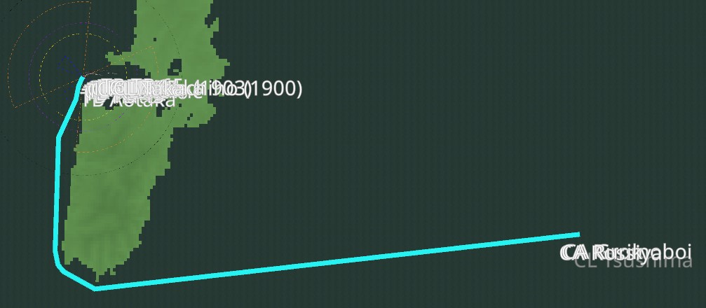

When the enemy is still far away, route rebuilding can be cooled down for up to `20 minutes` to avoid excessive recalculation. If the ship closes to tactical distance, the automatic route is cleared and tactical heading search takes over.

### Obstacle Avoidance

Obstacle avoidance is applied every movement step after ordinary control and automatic maneuvering. It can modify the current desired heading for any operational deployed ship, including manually controlled ships unless player obstacle avoidance is disabled.

For automatic ships, avoidance strength depends on range:

- **Strong avoidance:** used in tactical mode, or when automatic control cannot resolve a clean independent control root.
- **Weak avoidance:** used in operational mode (since obstacle is somewhat solved by pathfinding). It's also the player's default mode.

Player-controlled ships use the player obstacle-avoidance preference, with available modes **None**, **Weak**, and **Strong**.

The current primary avoidance method uses the ROI shore-distance field:

- The checker samples the ship's current shore distance and a preview point ahead on the current desired heading. This distance is measured in ROI shore-field pixels, where a larger value means more sea-room from land or other impassable shore-field cells.
- If the current shore distance is already beyond the early-exit distance, the desired heading is accepted immediately.
- The preview point is then compared with the **influence distance**. If the preview point is outside this distance, avoidance has no effect. If it is inside this distance, the closer it is to the **hard-clearance** distance, the stronger the avoidance weight becomes.
- The **original goal direction** is the heading the ship wanted before local obstacle correction.
- The **away-from-shore direction** is derived from the shore-field gradient. When both the current point and preview point have valid gradients, the game first combines them as 80% preview gradient + 20% current gradient, then normalizes the result. If the preview point has no valid gradient, use ony current gradient.
- The **tangent direction** is perpendicular to the away-from-shore direction. It represents sliding along the shoreline instead of turning directly away from it. The checker computes both left and right tangents, then chooses the one closer to the original goal direction.
- If the preview point is inside the hard-clearance distance, the steering is mostly tangent plus away-from-shore. If it is only inside the wider influence distance, the steering blends original goal, tangent, and away-from-shore directions.

The Weak and Strong ROI parameters are:

| Parameter | Weak | Strong | Meaning |
| --- | ---: | ---: | --- |
| `roiPreviewSeconds` | 37.5 | 75 | How far ahead the checker samples along the current movement direction. |
| `roiHardClearancePixels` | 0.75 | 1.5 | Inside this shore-distance band, avoidance becomes urgent. |
| `roiInfluenceDistancePixels` | 2 | 4 | Inside this band, the ship begins to bend away from the obstacle. |
| `roiEarlyExitDistancePixels` | 7.5 | 15 | If the ship is farther from shore than this, the checker accepts the current heading without extra work. |

If ROI shore-field avoidance is unavailable, the game falls back to a legacy heading test:

- It starts from the current desired heading and searches alternately to the right and left.
- Normal mode tests headings in `10 degree` increments; simple mode uses `20 degree` increments.
- A candidate heading must pass checks at the heading itself and at `+/-10 degrees`, giving the ship a small angular safety margin.
- Normal mode samples future positions at `30`, `60`, `120`, and `240` seconds ahead. Simple mode samples `60` seconds ahead.
- If any sampled point is land elevation, that heading fails.
- The first passing heading is used. If no candidate passes, the original desired heading remains.

## Plot Trajectory

Game historical trajectory can be plotted for ship. In the Ship State View's Time Loc Tabs, click the "Plot Trajectory On Map" button above the record table:

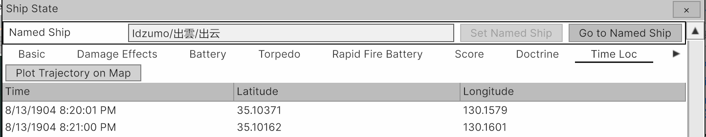

In the dialog, color and label can be configured:

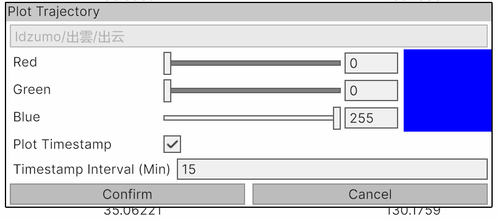

Two plotted trajectory looks like this:

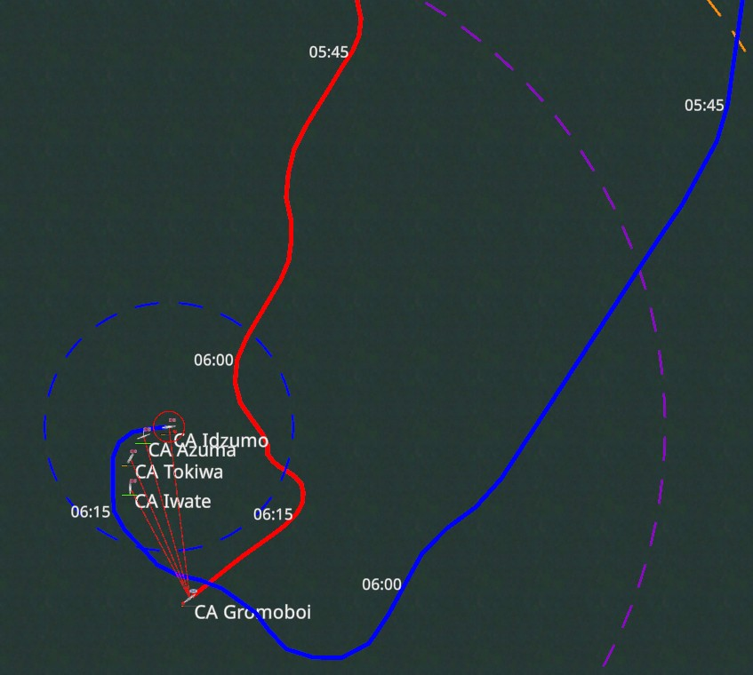

The trajectory will remain visible on the map until cleared using the "Clear Trajectories" button in the Tools Tab of the Top Tabs.

## Tutorial: Make a simple custom scenario

- Click "Start As Empty" in the main menu to create an empty scenario
- The "empty" scenario is not completely empty — two top groups Red and Blue, are created. You can check them in the Top tabs - Status - Order of Battle:

- Move camera to the area of interest
- Click the Insert button while the mouse is hovering on the map (not over the UI), and click on a point on the map. A dialog will appear:

There are three modes for inserting a ship:

- **Not Deployed Ship State**: Deploy a not deployed ship (the ship is usually created manually in the Ship State Editor). This is a somewhat advanced topic and is not covered in this tutorial.
- **Named Ship**: This create a Ship State from the selected Named Ship which is not associated with a Ship State (so that a Named Ship can only has a Ship State "embodiment") with proper initialization, and deploys it to map.
- **Ship Class**: This creates an "anonymous" Named Ship from the selected Ship Class and create a Ship State from that new Named Ship. It is used for hypothetical scenarios involving ship classes that exceed historical quantities. Some historical information from the built-in Named Ship is lost though.

Select Named Ship Yoshino (the first item in the Named Ship column), choose Blue in the "Attach to Group" Dropdown, and click the Confirm button. The historical Yoshino will be created on the map:

Click Insert again to open the insert dialog, you will notice Yoshino is no longer available in the Named Ship column. However it remains available in the Ship Class columns. Insert two more "anonymous" Yoshino by Ship Class method:

Select Yoshino1, click F or Follow button in the Top Tab and click on the Yoshino to set it to follow Yoshino. Then set Yoshino2 to follow Yoshino1. Set the desired speed of Yoshino (group leader) to 10 knots and heading to 90 degree (east). And click "Set to Formation Position" button in the Editor tab (if the button is not enabled, enable "Edit mode" in the Command tab). Position, speed and heading of ships would would be updated according to their formation relationships:

Now insert two other ships, set Attach to Group to Red and click "Set to Formation Position" to arrange them:

Switch to File Tabs, disable "Save without Streaming Asset" (required because some anonymous Named Ship were created) and click the "Save (Edit)" button to save the scenario:

Return to the main menu, click "Load Game" button to load the saved scenario to start to playing your new created custom scenario. 

## Weapon Target Assignment

### Automation Algorithm

In the default doctrine, every battery, torpedo, and rapid-firing battery on a ship would be arranged separately by the algorithm to reduce hostile potential firepower effectiveness. Thus following principle apply:

1. Fire Suppression: Deliver minimal firepower to enemy to create "under-fire" debuff to decrease their current fire projection.
2. Mission Kill: Prior to attack low-survivability platform with high available firepower.
3. Prevent Over-concentration: it is possible that some available batteries are not used.
4. Firepower stickiness: Firing platforms tend to remain engaged with the same target to avoid target-switching debuffs and to preserve visual coherence.

### Manual

#### Ship-Level

The ship-level manual attack target can be assigned via the information panel:

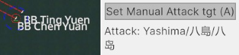

Click A or click the button and then click on the target. When the targeting is valid, "Attack: X" prompt would be displayed.

In the current implementation, this only restricts the automation algorithm's search space to prevent the ship from firing on other targets. However, the actual firing is not guaranteed, as the algorithm may deem the shot unfavorable due to the "over-concentration" penalty it introduces.
#### Mount-level

To manually perform mount-level targeting, auto-fire automation in the doctrine needs to be disabled. Otherwise automation will override manually specified value.
##### Battery

For a battery, both the mount and FCS's targets should to be set. Click the Set button and then click on a target:

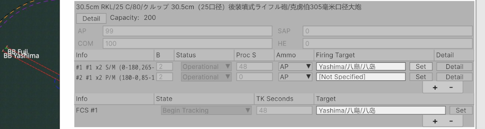

If ammo need to be manually specified, related automation in the doctrine should be disable.

##### Torpedo

Torpedo is similar to battery:

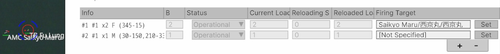

##### Rapid Firing Battery

Click the "+" button to create a "targeting record", select port or starboard, then assign guns to the target. (In theory, every gun can target a different target, as there's no FCS Local Control penalty) 

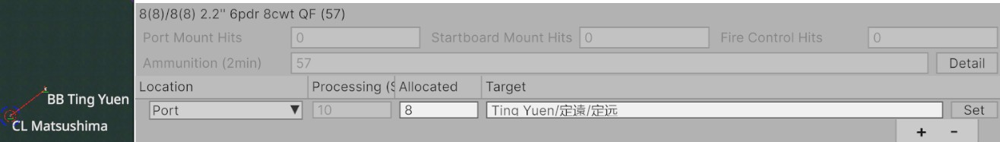

## Custom Ship Class

### Default value

After enabling **Edit Mode**, the Ship Class Editor can be used to edit existing ships or create new ones. A Ship Class contains two categories of data:

- **Physically meaningful real-world data**: displacement, armor, speed, rate of fire, penetration tables, etc.
- **Abstract system parameters in the SK5 system**: hit points, damage control value, target size, fire control value, Battery Data Rating, etc.

The SK5 rulebook itself does not explain how does these abstract system parameters are calculated. However, discussions on forums have mentioned possible calculation methods, or certain relationships are self-evident (for example, the fire control value of _Narrow_ is 60% of the corresponding _Broad_ value). To make it easier for players to create custom ships without needing to fully understand the rulebook or gather scattered information, most of these abstract system parameters in the game can be assigned default values derived from physically meaningful real-world data (players can later override these defaults). Some of these are based on fixed rules, while others come from fitted approximations (which are more applicable to pre-dreadnought ships). Some of the rules are as follows:

When **Displacement** is edited through the Ship Class Editor, the editor immediately refreshes the following default values. These values are only defaults; they can still be edited manually afterward.

- **Damage Point**: `round(100 * sqrt(max(0, displacement tons) * 0.033))`.
- **Target Size Modifier**:

| Displacement (tons) | Target Size Modifier |
| ------------------: | -------------------: |
|          `<= 671.5` |                 `-1` |
|           `<= 3110` |                  `0` |
|          `<= 16660` |                  `1` |
|           `> 16660` |                  `2` |

- **Damage Control Rating**:

| Displacement (tons) | Damage Control Rating |
| ------------------: | --------------------: |
|            `<= 111` |                   `0` |
|           `<= 1092` |                   `1` |
|           `<= 2975` |                   `2` |
|           `<= 3040` |                   `1` |
|         `<= 6202.5` |                   `3` |
|           `<= 9978` |                   `4` |
|        `<= 14262.5` |                   `5` |
|         `> 14262.5` |                   `6` |

- **Length, Beam, Draft, and Complement** are fitted estimates from displacement and ship type. The shared form is `exp(intercept + coefficient * ln(max(1, displacement tons)) + type offset)`. Length and beam are rounded to the nearest foot, draft is rounded to one decimal foot, and complement is rounded to the nearest integer with a minimum of `1`.

| Field | Intercept | Coefficient |
| --- | ---: | ---: |
| Length | `2.5669774` | `0.3904741` |
| Beam | `1.1975496` | `0.3171914` |
| Draft | `0.4707447` | `0.2975393` |
| Complement | `0.1084306` | `0.6979308` |

| Ship Type              | Length Offset |  Beam Offset | Draft Offset | Complement Offset |
| ---------------------- | ------------: | -----------: | -----------: | ----------------: |
| Battleship             |  `-0.2935404` |  `0.0903524` | `-0.0231818` |      `-0.2131911` |
| Armored Cruiser        |  `-0.1377085` |  `0.0465869` |  `0.0322265` |       `0.0607233` |
| Torpedo Boat           |   `0.5236686` |  `0.0391832` | `-0.4071087` |      `-0.2046980` |
| Destroyer              |   `0.5377667` | `-0.0055650` | `-0.1104536` |      `-0.0844927` |
| Patrol Gunboat         |   `0.0132753` |  `0.0545587` | `-0.1003142` |      `-0.1349758` |
| Transport              |   `0.0905690` |  `0.0005691` |  `0.5143422` |      `-0.6856862` |
| Armed Merchant Cruiser |   `0.1020602` |  `0.0099036` |  `0.5230984` |      `-0.6651469` |
| Repair                 |   `0.2181666` | `-0.1220814` | `-0.4029193` |      `-0.4685847` |
| Battlecruiser          |  `-0.0521659` |  `0.0744055` | `-0.1574514` |      `-0.3309420` |
| Other types            |           `0` |          `0` |          `0` |               `0` |

Changing **Ship Type** also recalculates length, beam, draft, and complement from the current displacement.

**Armor** is stored as actual inches and effective inches for each armor location. When an Armor Type is selected, the editor sets the armor coefficient from the table below and recalculates every effective armor value as `round(actual inches * coefficient, 1)`. If the coefficient is edited directly, the editor tries to infer the Armor Type only when exactly one armor type has that coefficient; otherwise the type becomes `NotSpecified` (Not defined or mixed).

| Armor Type                             | SK5 Armor Factor | Okun Material / Rule                                     | Okun Field       | Okun Value                               | Derivation              |
| -------------------------------------- | ---------------: | -------------------------------------------------------- | ---------------- | ---------------------------------------- | ----------------------- |
| No Armor                               |                0 | -                                                        | -                | -                                        | game placeholder        |
| Wrought Iron                           |             0.60 | WROUGHT IRON ARMOR                                       | Average Quality  | approx. 0.55-0.60                        | selected / rounded      |
| Mild Steel                             |             0.75 | AVE. “MILD/MEDIUM” STEEL                                 | Average Quality  | 0.75                                     | direct                  |
| Compound Hard Steel Faced Wrought Iron |             0.68 | “COMPOUND” HARD-STEEL-FACED WROUGHT IRON                 | Q / QD           | Q=0.75; QD=0.60                          | likely mean / rounded   |
| Nickel Steel                           |             0.90 | AVE. NICKEL-STEEL ARMOR                                  | Average Quality  | 0.90                                     | direct                  |
| Harvey Mild Steel                      |             0.74 | AVE. HARVEYIZED MILD STEEL                               | Q / QD           | Q=0.78; QD=0.70                          | mean(Q,QD)              |
| Harvey Nickel Steel                    |             0.78 | AVE. HARVEYIZED NICKEL-STEEL                             | Q / QD           | Q≈0.805; QD≈0.75                         | mean / rounded          |
| Krupp Chrome Nickel Steel              |             0.95 | Krupp “HIGH-%” Nickel-Steel                              | Average Quality  | 0.95                                     | direct                  |
| Krupp Cemented 1894                    |             0.83 | Original KC / KC a/A                                     | Q                | Q=0.828                                  | rounded                 |
| High Tensile Steel                     |             0.82 | AVE. HIGH-TENSILE STEEL                                  | Average Quality  | 1895=0.80; post-WWI=0.85                 | interpolated / selected |
| Class A Armor 1900                     |             0.83 | AVE. WWI-ERA CLASS “A” ARMOR / early Class A rule        | Q                | Q≈0.828                                  | rounded                 |
| Krupp Nickel Steel                     |             0.83 | likely KC a/A or default pre-1911 FH armor               | Q                | Q≈0.828                                  | rounded                 |
| Krupp Non-Cemented                     |             0.95 | KRUPP NON-CEMENTED / KNC-like homogeneous armor          | Average Quality  | 0.95                                     | direct                  |
| Krupp Cemented WW1 Era 1905            |             0.83 | default face-hardened armor through 1910                 | Q                | Q=0.828                                  | rounded                 |
| Witkowitzer KC                         |             0.95 | IMPROVED AUSTRO-HUNGARIAN WITKOWITZER KC                 | Q                | Q=0.947                                  | rounded                 |
| Class A Armor Midvale Non-Cemented     |             0.88 | MIDVALE NON-CEMENTED CLASS “A”                           | Q / special case | likely around 0.889 or scaling-dependent | uncertain               |
| Class B Armor 1910                     |             0.95 | early STS / WWI-era Class “B” homogeneous armor          | Average Quality  | 0.95                                     | direct                  |
| Special Treatment Steel                |             1.00 | SPECIAL TREATMENT STEEL / STS                            | Average Quality  | 1.00                                     | direct                  |
| Class A Armor 1911                     |             0.89 | AVE. WWI-ERA CLASS “A” ARMOR                             | Q                | Q=0.889                                  | rounded                 |
| Krupp Cemented WW1 Era 1911            |             0.85 | default FH armor 1911–1921                               | Q                | Q=0.850                                  | direct                  |
| Krupp Wotan Hard Nickel Steel          |             1.00 | German WOTAN HART / Wh / Wotan Härte                     | Average Quality  | 1.00                                     | direct                  |
| D Silicon Manganese HT Steel           |             0.90 | AVE. EXTRA-HIGH-STRENGTH “D” SILICON-MANGANESE HT STEELS | Average Quality  | 0.90                                     | direct                  |
| New Vickers Non-Cemented               |             0.95 | NEW VICKERS NON-CEMENTED / NVNC                          | Average Quality  | 0.95                                     | direct                  |
| Non-Cemented Armor                     |             1.00 | AVE. NON-CEMENTED ARMOR / NCA                            | Average Quality  | 1.00                                     | direct                  |
| Krupp Cemented 1928                    |             1.00 | Krupp Cemented new type / KC n/A                         | Q                | Q=1.00                                   | direct                  |
| PO Homogenous Plate                    |             1.00 | PIASTRE OMOGENEE / PO                                    | Average Quality  | 1.00 estimated                           | direct                  |
| Italian WW2 Era Krupp Cemented         |             1.00 | ITALIAN WWII KRUPP CEMENTED                              | Q                | Q=1.00 estimated                         | direct                  |
| British Cemented Armor                 |             1.00 | BRITISH CEMENTED ARMOR / CA                              | Q                | Q=1.00                                   | direct                  |
| Class B Armor 1933                     |             1.00 | WWII-era CLASS “B” ARMOR                                 | Average Quality  | 1.00                                     | direct                  |
| Class A Armor 1933                     |             1.00 | improved USN CLASS “A” ARMOR / post-1921 FH default      | Q                | 1.00                                     | direct / default        |
| Vickers Non-Cemented                   |             0.84 | VICKERS HARDENED NON-CEMENTED / VH                       | Q                | Q=0.839                                  | rounded                 |
| Molybdenum Non-Cemented                |             0.97 | MOLYBDENUM NON-CEMENTED / MNC                            | Average Quality  | 0.97                                     | direct                  |

(The above table is mix of SK5 chart value and their Okun's material derivation: [Table of Metallurgical Properties of Naval Armor and Construction Materials](http://www.navweaps.com/index_nathan/metalprpsept2009.php) )

For **Battery** records, editing Shell Size or Shell Weight through the editor updates **Damage Rating** as `floor(0.4 + 1.30 * shell size in inches + 0.82 * sqrt(shell weight in pounds) + 0.5)`. The value remains manually editable afterward.

The **Reset Fire Control Table** button rebuilds values from the fitted fire-control model. If the table is empty, rows are first created for target speeds `9`, `18`, `27`, `36`, and `45` knots. The model computes a latent value for 9 knots/short/broad, then each cell is `floor(latent * speed factor * range factor * aspect factor + 0.5)`.

| Speed Threshold | Factor |
| ---: | ---: |
| `9` | `1` |
| `18` | `0.6710` |
| `27` | `0.5265` |
| `36` | `0.4393` |
| `45` | `0.3758` |

| Range Band | Factor |
| --- | ---: |
| Short | `1` |
| Medium | `0.6010` |
| Long | `0.4165` |
| Extreme | `0.3567` |

| Aspect | Factor |
| --- | ---: |
| Broad | `1` |
| Narrow | `0.6005` |

If the fire-control system has a code, the latent value is `4.5261 + code offset + 0.2334 * shell size - 0.0823 * displacement tons / 1000`.

| FCS Code | Offset |
| --- | ---: |
| Z | `0` |
| Y | `2.1829` |
| X | `4.2304` |
| W | `4.1718` |
| U | `2.4735` |
| T | `4.0784` |
| S | `5.2111` |
| R | `6.0497` |
| Q | `7.4472` |

If no code coefficient is available, the component model is used instead: `4.7316 + 0.2128 * shell size - 0.0893 * displacement tons / 1000`, plus `1.8941` for Telescope gun sight, `2.1650` for Basic fire-control instrument, `1.5337` for Optical rangefinder, and `1.9988` for Follow-the-Pointer director control.

Fire Control Code and Component only serve to set the default values of the Fire Control Table (and also act as a form of remark/annotation). Their values themselves do not affect resolution, because their effects are already fully captured by the Fire Control Table, which acts as a [sufficient statistic](https://en.wikipedia.org/wiki/Sufficient_statistic).

The **Reset Penetration Table** button clears the penetration table and rebuilds it from the fitted penetration model. It creates rows at `2000`, `4000`, `6000`, `8000`, `10000`, `12000`, `15000`, `18000`, `21000`, `24000`, `27000`, `30000`, `33000`, and `36000` yards, stopping at the first row that covers the battery range. If range is not positive, only the `2000` yard row is created. Rate of fire is `round to 0.1(min(maxRateOfFire * 2, 120 / (9.090133 + distance yards / 371.07068)))`. The range bands (short/medium/long/extreme) is based on `distance / range`; the default cutoffs are `0.56`, `0.90`, and `1.05`, adjusted by `-0.08` and `-0.10` for the first two cutoffs when range is `<= 5900` yards, and by `+0.08` for all three cutoffs when shell size is at least `12` inches.

Vertical penetration is:

`round to 0.1(exp(-7.19567 - 0.596694 * ln(shell size) + 0.702142 * ln(shell weight) + 0.733421 * ln(range yards) + 0.0331102 * max ROF + 0.402345 * distance kyd + 0.00675885 * distance kyd^2 + 0.0367314 * ln(shell size) * distance kyd - 0.0718001 * ln(range yards) * distance kyd))`

Horizontal penetration is:

`round to 0.1(exp(-13.5807 - 0.404477 * ln(shell size) + 0.492548 * ln(shell weight) + 1.01641 * ln(range yards) - 0.0211344 * max ROF + 3.84280 * distance/range - 1.27663 * (distance/range)^2))`

For **Rapid Firing Battery**, the optional metadata stores shell size and shell weight. If no metadata exists, shell size defaults to `1.85` inches. The **Infer Other** button in the metadata dialog only changes Damage Factor: if shell size is positive, `damageFactor = floor(-0.7518 + 4.9134 * shell size + 0.5)`; otherwise, if shell weight is positive, `damageFactor = floor(4.1853 + 1.4080 * shell weight - 0.04657 * shell weight^2 + 0.5)`. If neither value is positive, nothing is changed.

### NAAB-like Calculator

The **NAAB-like Calculator** is a shell trajectory and armor penetration tool inspired by [Naval Armor and Ballistics program](http://www.panzer-war.com/Naab/NAaB.html). It can be opened from the main menu for standalone experiments, or from a Battery record's metadata when fitting SK5 penetration table data back into a ship class.

#### Models

The calculator has two connected models: an exterior ballistic model that finds the shell's flight path, impact velocity, and angle of fall, and a terminal ballistic model that turns the impact state into vertical and horizontal armor penetration.

##### Exterior ballistic

The exterior-ballistic part follows the Army Standard Metro point-mass formulation described in Robert L. McCoy's [Modern Exterior Ballistics](https://www.mori.bz.it/Balistica/Mc%20Coy%20Modern%20Exterior%20Ballistic.pdf), Chapter 8, especially the standard-atmosphere discussion on pages `165`-`168` and the MCTRAJ Q-BASIC reference program on pages `183`-`185`.

- The initial state is built from muzzle velocity and gun elevation:
	- `theta = elevationDeg * pi / 180`.
	- `vx = muzzleVelocityFeetPerSecond * cos(theta)`.
	- `vy = muzzleVelocityFeetPerSecond * sin(theta)`.
	- `x = 0`, `y = 0`, `time = 0`.
- At each height `h` in feet, the pre-1962 atmosphere approximation is:
	- `temperatureRankine = 518.67 * exp((-6.015e-06) * h) + 1e-10`.
	- `soundFeetPerSecond = sqrt(temperatureRankine) * 49.19 + 1e-10`.
	- `densityRatio = exp((-3.158e-05) * h)`.
	- `radiusMeters = 6378135 + h * 0.3048`.
	- `gravityFeetPerSecondSquared = (3.989411596224e14 / radiusMeters^2) / 0.3048`.
- The shell speed and Mach number are:
	- `speed = sqrt(vx^2 + vy^2)`.
	- `mach = speed / soundFeetPerSecond`.
- The selected drag function (`G1`, `G2`, `G5`, `G6`, `G7`, `G8`, `G9`, `GS`, or `GL`) supplies `cdRef` by interpolation from embedded drag tables.
- The effective ballistic coefficient is normally `BC`. If **Drag Coefficient** is non-zero, the calculator adjusts only while `Mach > 1`. Before the shell first reaches `Mach <= 1`, the range term is simply current range. If a later state has already recorded a `Mach <= 1` crossing and then returns to `Mach > 1`, the solver uses:
	- `rangeTerm = abs(firstMachLeOneRangeFeet + firstMachGtOneAfterThatRangeFeet - currentRangeFeet)`.
	- `BCeff = max(0.01, BC + dragCoefficientAdjust * rangeTerm / 600000)`.
- The differential equations are expressed against horizontal distance `x`, not directly against time:
	- `dragSlope = 0.0002048757 * densityRatio * cdRef * speed / BCeff`.
	- `dy/dx = vy / vx`.
	- `dvx/dx = -dragSlope`.
	- `dvy/dx = (dvx/dx) * (vy / vx) - gravityFeetPerSecondSquared / vx`.
	- `dt/dx = 1 / vx`.
- Integration uses the **Integration Step** field as a fixed horizontal step `dx` in feet. Each step first predicts an Euler point, then uses the average of the starting and predicted slopes:
	- `nextValue = currentValue + 0.5 * dx * (slopeAtCurrent + slopeAtPredicted)`.
- For a ground-impact run, the solver continues until the shell crosses `y = 0`, `time > 300`, the horizontal velocity collapses, or the simulation range limit is reached. The impact point is linearly interpolated between the last positive-height state and the first non-positive-height state.
- The exterior result is:
	- `rangeYards = impactXFeet / 3`.
	- `timeOfFlightSeconds = impactTime`.
	- `impactVelocityFeetPerSecond = sqrt(impactVx^2 + impactVy^2)`.
	- `angleOfFallDeg = max(atan2(-impactVy, impactVx) * 180 / pi, 0)`.
- When solving for a requested target range rather than firing to the ground at a fixed elevation, the solver searches for the low-angle firing solution. It scans elevation windows, brackets the requested range, and refines the elevation until the target range is reached.

##### Terminal ballistic

The terminal-ballistic model can be read as two layers:

- **Okun basis**: the normal ballistic limit calculation is based on Nathan Okun's armor penetration programs, mainly the homogeneous-armor [M79APCLC](https://www.navweaps.com/index_nathan/M79apdoc.php), with [FaceHard](https://www.warship1.cn/navweaps/index_nathan.htm) used as a reference for related projectile, cap, and armor terminology.
	- For a plate thickness `T`, the Okun-style homogeneous-armor core uses:
		- `D = max(projectileDiameterInches, 0.1)`.
		- `td = clamp(T / D, 0.001, 5.99999)`.
		- `WoverD3 = max(totalWeightPounds / D^3, 1e-9)`.
		- The embedded `td` tables select `A`, `B`, a sine amplitude, a sine frequency, and a sine phase.
		- `tdShape = 1 + sineAmplitude * max(sin((td * sineFrequency - sinePhaseDeg) * pi / 180), 0)`.
		- `diameterScale = sqrt(max(1e-9, 1 - 0.04 * ln(D / 3)))`.
		- `elongationFactor = 1 - (1 - sqrt(clamp(elongationPercent, 0.1, 25) / 25)) * (max(D, 8) - 8) / 8`.
		- `baseNBL = A * (max(plateQuality, 0.01) * td)^B * tdShape * diameterScale / sqrt(WoverD3)`.
	- Obliquity then modifies `baseNBL`:
		- If obliquity is below `45` degrees, `obliquityMultiplier = interpolate(lowObliquityReferenceVector, obliquity) / cos(obliquity)`.
		- If obliquity is `45` degrees or higher, `obliquityMultiplier = bilinearInterpolate(highObliquityReferenceMatrix, td, obliquity) / cos(obliquity)`.
		- `baseNBL *= obliquityMultiplier` when obliquity is above `0.1` degrees.
- **NAAB-like layer**: the calculator emulates parts of Steven Lorenz's [Naval Armor and Ballistics](http://www.panzer-war.com/Naab/NAaB.html) program so that I can compare result of NAAB's projectile data. The result should be close to NAAB though not identical. 
	- The armor input is converted into the effective `plateQuality` used by the Okun-style core:
		- `plateQuality = clamp(armorQuality * HardnessProfile(235) / HardnessProfile(BHN), 0.5, 1.1)`.
	- Windscreens and AP caps add to NBL through table-based addends:
		- `windscreenPercent = 100 * windscreenWeightPounds / totalWeightPounds`.
		- `windscreenAddend = (windscreenPercent / 5.1) * selectedWindscreenMultiplier * interpolatedWindscreenTableValue`, unless the shell has no windscreen or the plate is too thin for that addend.
		- Hard caps and medium caps use `apCapPercent = 100 * apCapWeightPounds / totalWeightPounds`.
		- For hard caps, `capRatio = apCapPercent / 20` and the low-obliquity cutoff is `50` degrees.
		- For medium caps, `capRatio = apCapPercent / 10` and the low-obliquity cutoff is `65` degrees.
		- The cap threshold is `0.42` above `65` degrees, `0.44 - 0.002 * (obliquity - 55)` above `55` degrees, and `0.66 - 0.18 * (obliquity / 45)` otherwise, rounded to `0.001`.
		- If `td` is above the threshold and obliquity is below the cap type's cutoff, the cap addend is `capTableValue * (1 + 0.6 * (capRatio - 1))`.
		- If `td` is not above the threshold and `40 < obliquity < 75`, the shared mid-obliquity cap addend is `sharedCapTableValue * capRatio`.
	- The final normal ballistic limit is:
		- `trueNBL = baseNBL * elongationFactor * (1 + windscreenAddend + capAddend)`.
	- Search for the armor thickness `T` such that `trueNBL(T, obliquity) == impactVelocity`.
	- `T` is post-scaled by shell quality and extreme obliquity:
		- If `80 <= obliquity < 90`, `extremeScale = (cos(obliquity) / cos(80))^1.1`; otherwise `extremeScale = 1`.
		- `postScale = extremeScale * clamp(effectiveShellQuality, 0.2, 1.2)`.
	- The calculator computes both vertical and horizontal armor penetration from the same impact state:
		- `sideObliquity = armorInclinedDeg + angleOfFallDeg`.
		- `deckObliquity = armorInclinedDeg + max(90 - angleOfFallDeg, 0)`.
		- `verticalPenetration = T(impactVelocity, sideObliquity) * postScale`.
		- `horizontalPenetration = T(impactVelocity, deckObliquity) * postScale`.

##### Parameter meanings

- **Armor Preset**: fills the armor fields with a known quality, elongation, and BHN combination.
- **Armor Quality**: material quality multiplier before BHN correction.
- **Elongation (%)**: ductility input used by the terminal model's `elongationFactor`.
- **BHN**: Brinell hardness number. It changes the effective plate quality through the embedded hardness profile.
- **Inclined (deg)**: extra obliquity added to side and deck penetration calculations.
- **Projectile Preset**: fills the shell fields with a known projectile.
- **Diameter**: shell caliber in inches.
- **Total Weight**: complete projectile weight in pounds, used in `W / D^3`.
- **Body Weight**: shell body weight. It is stored with the projectile data and is useful for comparing shell designs.
- **Windscreen**: windscreen weight in pounds, converted to `windscreenPercent`.
- **AP Cap Weight**: armor-piercing cap weight in pounds, converted to `apCapPercent`.
- **Cap Type**: `None`, `Hard Cap`, `Medium Cap`, `Soft Cap`, or `Hood`. The current terminal formula applies cap addends only to hard and medium caps.
- **Windscreen NBL Addend Multiplier**: normal multiplier for the windscreen NBL addend.
- **Hi-Obl Windscreen NBL Addend Mult.**: alternate windscreen multiplier used above the high-obliquity threshold.
- **High-Obliquity Threshold**: obliquity where the high-obliquity windscreen multiplier starts to apply. A non-positive value disables the alternate multiplier.
- **Muzzle Velocity**: launch velocity in feet per second.
- **Max Range**: maximum range in yards. It is used as the simulation limit, the maximum-range fitting target, and the Battery record range during Sync Back.
- **Max Elevation**: maximum gun elevation in degrees.
- **Drag Function**: reference drag curve used for `cdRef`.
- **Ballistic Coefficient**: main exterior ballistic tuning parameter.
- **Drag Coefficient**: optional range-dependent adjustment to the ballistic coefficient.
- **Effective Shell Quality**: final post-scale for terminal penetration, clamped to `0.2` through `1.2`.
- **Integration Step**: horizontal integration step in feet. Smaller values are slower but more precise.
- **Elevation Mode**:
  - **Range**: fires a series of fixed elevations from Start Elevation to End Elevation by Elevation Step.
  - **Search Fix**: solves the low-angle firing solution at regular range intervals set by Range Step.
  - **Search SK5**: solves the low-angle firing solution at SK5 penetration-table ranges, or at the default SK5 range list when no source table is available.
- **Plot Mode**:
  - **None**: only the result list is shown.
  - **Trajectories**: plots shell trajectories. When many rows exist, the chart shows representative first, middle, and last trajectories.
  - **Penetration**: plots horizontal and vertical penetration against range.

#### Usage

- **Simple use without SK5 Data**:
	- Open **NAAB-like Calculator** from the main menu.
	- On the **Ballistic** tab, choose a projectile preset and an armor preset, or enter the projectile and armor parameters manually.
	- Use **Elevation Mode** to decide what rows are generated:
		- **Range** is best for seeing what a fixed set of elevations does. It is useful for comparing trajectory shapes.
		- **Search Fix** is best for penetration curves at evenly spaced distances.
		- **Search SK5** is still usable without SK5 data; it uses the standard SK5 distance list and includes Max Range when needed.
	- Use **Plot Mode** to choose the chart:
		- **Trajectories** shows range versus height.
		- **Penetration** shows range versus horizontal and vertical penetration.
	- Press **Calculate**. The result table columns are:
		- **Range**: impact range in yards, or the requested target range when the solver is in a search mode.
		- **Horizontal Pen**: calculated deck/horizontal penetration in inches. Without SK5 comparison data it is displayed as a single value.
		- **Vertical Pen**: calculated side/vertical penetration in inches. Without SK5 comparison data it is displayed as a single value.
		- **ROF**: calculated rounds per two minutes when SK5 comparison context exists. The formula is `min(120 / (timeOfFlight + fallToNextFireSeconds), maxRateOfFireShootPerMin * 2)`.
		- **Range Band**: range band inferred from angle of fall. The thresholds are **Short** below `7` degrees, **Medium** from `7` to `20` degrees, **Long** above `20` through `40` degrees, and **Extreme** above `40` degrees.
		- **Impact Velocity**: impact speed in feet per second.
		- **Angle of Fall**: downward impact angle in degrees.
		- **Time of Flight**: flight time in seconds.
		- **Elevation**: gun elevation used to reach that row.

- **SK5 fitting workflow**:
	- Open the **Ship Class Editor**, go to the relevant **Battery** record, and press **Meta Info**.
	- In the metadata dialog, enable **Has Meta Info** if needed. The dialog stores the NAAB-like projectile seed for this Battery record. If metadata is created from an existing Battery record, shell size, shell weight, and range are used to initialize the projectile.
	- Press **Open NAAB-like Calculator** from the metadata dialog. This launch mode is different from the simple main-menu mode because the calculator is now tied to the source Battery record and can compare against, fit, and sync back SK5 data.
	- On the **SK5 Data** tab, review or edit the source penetration rows:
	    - **Range Band**: SK5 range band for the row.
	    - **Distance Yards**: row distance in yards. During fitting, the last row uses Battery Max Range as the target range, because Battery penetration rows are threshold rows.
	    - **Rate of Fire**: SK5 rounds per two minutes for the row.
	    - **Hor Pen**: SK5 horizontal penetration in inches.
	    - **Vert Pen**: SK5 vertical penetration in inches.
	    - **Max ROF**: gun mechanical maximum rate of fire in shots per minute. The calculator converts it to rounds per two minutes with `maxRateOfFireShootPerMin * 2`.
	    - **Fall To Next Fire (s)**: delay added after shell fall before the next firing cycle. It participates in `120 / (timeOfFlight + fallToNextFireSeconds)`.
	- Fit the exterior ballistics first:
		- Set a reasonable projectile, muzzle velocity, max range, max elevation, drag function, drag coefficient adjustment, and integration step.
		- Press **Fit External Ballistic**.
		- The fit adjusts **Ballistic Coefficient**. **Drag Coefficient** remains fixed, so use it manually when a single ballistic coefficient cannot match both the short-range and long-range behavior.
		- For each SK5 row, the solver predicts the angle of fall and converts it to a range band. The range-band score is `bandDelta^2 * 10`, with a failed solution counted as `100`.
		- The max-range score is `(predictedMaxRange - MaxRange)^2 / MaxRange^2 * 250`, with a failed max-range solution counted as `250`.
		- The best ballistic coefficient is applied back to the visible fields and the calculator reruns.
	- Fit the terminal ballistics second:
		- After the exterior fit is close enough, press **Fit Terminal Ballistic**.
		- The fit adjusts **Effective Shell Quality**.
		- For each SK5 row, the calculator computes vertical and horizontal penetration from the fitted impact velocity and angle of fall.
		- The score is the sum of squared relative errors: if the SK5 value is positive, `((calculated - SK5) / SK5)^2`; if the SK5 value is non-positive, a non-positive calculated value scores `0` and any positive calculated value scores `1`.
		- The best shell quality is applied back to the visible fields and the calculator reruns.
	- Inspect the comparison results:
		- When SK5 data is present, **Horizontal Pen** and **Vertical Pen** are displayed as `calculated/SK5 in`.
		- **ROF** is displayed as `calculated/SK5`.
		- **Range Band** is displayed as `calculated/SK5`.
		- If the exterior range bands are off, adjust exterior parameters and refit. If the penetration numbers are off after the exterior fit is acceptable, adjust armor or projectile terminal parameters and refit shell quality.
	- Sync the fitted data back:
		- Use **Round Sync Back Values To 1 Decimal** when you want the Battery record to keep SK5-style one-decimal penetration and ROF values.
		- Press **Sync Back**. This is only available when the calculator was opened from a Battery metadata dialog.
		- Confirm the summary of added, deleted, and changed rows.
		- Sync Back writes Battery Max Range, Max ROF, Shell Size, Shell Weight, the Battery penetration table, the stored NAAB-like projectile metadata, and Fall To Next Fire.
		- The generated penetration table uses calculated range, calculated ROF, calculated range band, horizontal penetration, and vertical penetration. If a calculated row is the Battery max range, its table distance is stored as the next SK5 threshold row while the actual max range remains on the Battery record.

### Existing weapon selector

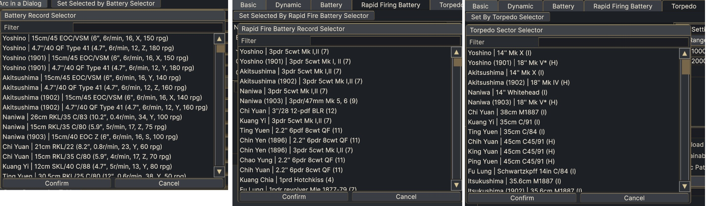

For **Battery**, **Rapid Firing Battery**, and **Torpedo**, even with reasonable default values, manually filling out those tables can still be cumbersome. In such cases, you can directly use the buttons at the top to copy the Battery, Rapid Firing Battery, or Torpedo setup from another ship and apply it to the current one. For example, you could combine the main battery from Ship A, the secondary battery from Ship B, the rapid-firing batteries 1 and 2 from Ship C, and the torpedoes from Ship D.

## Multiplayer

The Naval Tactical Mode's WEGO mode can be played in multiplayer. The auto-playing multiplayer mode is not supported yet.

The host start a "room" and other client connect to the host. Each client can assign its own Take Command units, while the host commands remaining units. For example:

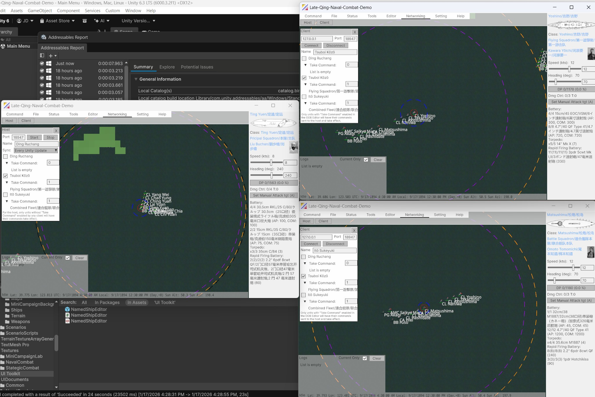

 In the above image, there are three game windows, the left one is the host. The right two on the right are clients connected to the host. The upper-right client takes command of the Flying Squadron, the lower-right client takes command of the Combined Fleet. As a result, the effective command partition is:

- Player Tsuboi Kōzō: Command the Flying Squadron
- Player: Itō Sukeyuki: Command the Combined Fleet excluding the Flying Squadron (since it's taken by Tsuboi Kōzō)
- Player Ding Ruchang: Command the Beiyang Fleet (or, equivalently, all force excluding the Combined Fleet taken by Itō Sukeyuki, which results in the only remaining force, Beiyang Fleet).

Note: This is a somewhat historically accurate setup. Tsuboi Kōzō, as a subordinate of Itō Sukeyuki, often executed his own commands when he believed them to be better, sometimes ignoring or misunderstanding Itō Sukeyuki orders.

### How to Set This Up:

- Player Ding Ruchang
	- Select a scenario
	- Click the Host button (Top Tabs - Networking - Host) to popup the Host dialog.
	- Click Start to begin hosting.
	- Change name to Ding Ruchang
- Player Tsuboi Kōzō:
	- Start as Empty
	- Click the Client button (Top Tabs - Networking - Client) to popup the Client dialog.
	- Enter the host's IP address and click Connect.
	- The client will receive a full synchronization from the host. So the scenario does not need to exist locally for the client.
	- Change name to Tsuboi Kōzō
	- Tsuboi Kōzō then open OOB Editor (via hyperlink in the information panel or Top Tabs - Status - Order of Battle)
	- Find Flying Squadron and toggle Take Command on:

- Player Itō Sukeyuki:
	- Similar procedure as Tsuboi Kōzō but different name and Take Command
	- The order of clients joining is interchangeable, but both should connect after the host has started.

### Turn Execution

To execute 1 WEGO step, the Host and all Clients with at least one Take Command unit must be in the Ready state before the game can advance. 

Normal advance command, such as hotkeys 1~9 (advance 1~9 minutes), the backquote key (advance 1 pulse) or the corresponding buttons, issued by client will send the client's commanded unit states to the host as a Merge Request. These states are merged into the host's state only when advancement is triggered; they are not applied immediately upon arrival.

Once a client submit a Merge Request, it is flagged as Ready, indicated by a checkmark in the corresponding checkbox (in the example above, the checkmark next to Tsuboi Kōzō indicates that he is ready). Before all players are ready, a ready client may still submit additional Merge Request to update his current command state.

For the host:

- If the host issues an advance command and is the last player to become ready, the advancement happens immediately for the specified timespan, after all client Merge Requests are merged into Host state. 
- If Host is not the last to become ready, the advancement occurs when the final client submit its Merge Request.

Depending on the synchronization mode, during advancement either:

- the full state is continuously sent from the host to all clients, or  
- the full state is sent only after advancement is completed.

Afterward, players observe the newly advanced turn, make new decisions, and mark themselves as ready again to advance to the next turn.

### Notes

- Default 1-minute turn (RTW style) may be too short for WEGO multiplayer gameplay. Miniatures wargames provide alternative approaches: Seekrieg uses 2-minutes turn, while the Admiralty Trilogy uses 3-minutes turn, although they sometimes also use 1-minute turn or 30--seconds turn. A 2-minutes or 3-minute turn can be used by having host advance the simulation using hotkey 2 or 3.
- Chat is not implemented yet. You can use external chat app like Discord.
- This traditional LAN networking can also be used over the internet with additional tools such as Hamachi.
- The game was not originally designed to support multiplayer, so the synchronization method is somewhat clumsy. Technically, I use overly coarse-grained commands for synchronization instead of breaking them into many smaller command, which significantly slows the game and imposes heavy traffic burden. As a result, continues-time multiplayer (similar to JTS Naval Campaign) is not implemented yet. However I may revisit this issue after completing other higher-priority work.

# Strategic Mode

## Getting Started

## Strategic Group & Land Unit

The strategic layer is built around **Strategic Groups** and **Land Units**.

A Strategic Group is primarily an order-of-battle container. It can represent a fleet, base, headquarters, infantry formation, artillery formation, and other command-level formations. A group can be in one of three practical states:

- **Independent**: the group is on the map and can move or fight on its own.
- **Combined**: the group is attached under another group and shares that parent group's location.
- **Not Deployed**: the group is off-map or temporarily removed from the map, for example while being transported.

Land Units are the actual manpower-bearing subunits inside those groups. Their template defines type, quality, weapon mix, and nominal strength. The current build supports unit categories such as infantry, cavalry, artillery, mountain artillery, engineers, supply units, military police, and ports.

Each land unit tracks several operational values:

- **Strength**: current manpower.
- **Suppression**: short-term combat disruption.
- **Morale**: slower-changing combat willingness.
- **Fatigue**: accumulated exhaustion.
- **Supply Tons**: carried supply.

## Movement

Strategic movement is resolved along a planned path, one hour at a time.

For land groups, speed depends mainly on terrain and infrastructure:

- roads and railroads are much faster than open terrain,
- rough, forest, swamp, and mountain terrain are slower,
- if any non-supply land unit in the group is out of supply, the whole group's land speed is reduced.

For fleet groups, strategic speed is determined by the slowest deployed ship in the group, using a cruising speed rather than full tactical speed. A fleet with no supply left can still move, but only very slowly. If the game judges that the fleet no longer has enough endurance to return to its base, the fleet is ordered to return automatically.

Fleets cannot enter a sea cell that contains a hostile base with coast batteries,

### Cell Control and Movement

- Control of a cell is divided between the cell itself and its six edges.
- When only one side’s units are present in a cell, that side controls the cell and all six of its edges.
- When a unit from one side moves into a cell already controlled by the other side, the edge of that cell pointing toward the source cell is taken over by the moving side.
- If an edge of a cell is not controlled by your side, you cannot move across that edge into the adjacent cell (therefore, a unit that moves in can “cover” the cell it just left).

## Supply

### Supply Cap and Supply Consumption

- The supply cap and consumption of land units are determined by their strength and type.
- The supply cap and consumption of ships are determined by their type and tonnage.
- A depot’s supply cap equals 30 days of supply for all land units it currently supports, plus all ships that have it set as their home port, plus the supply caps of downstream depots.
- During turn resolution, a depot will always attempt to refill its supply to the cap through the land network.

### Sea Transport Supply

- If a coastal depot cannot connect to the land supply network, its supply will fall below the cap, creating a deficit.
- If the depot belongs to the AI, or if the player has enabled supply automation, transport ships will be drawn from the idle transport pool to initiate supply sub-mission for it.

## Naval Transfer

If **Army Path Finding Mode** is set to _Enable Naval Transport_, right-click pathfinding will consider not only normal land movement but also routes that travel by sea to reach the destination. This is referred to as “mixed pathfinding.”

Regardless of the actual locations and positions of available transport ship assets, mixed pathfinding uses the following assumptions:

- Units can embark at a port with a depot, taking 3 days (the actual time depends on the location of transport ship assets; in the current implementation, embarking itself takes no time).
- Units move at sea at a speed of 6 knots (the actual speed depends on the transport ships themselves).
- Units disembark at the landing point, taking 1 day (in the current implementation, disembarking itself takes no time).

In the path, naval segments are marked with a light blue circle indicating the embarkation point and a light red circle indicating the disembarkation point:

When a strategic group is attempting to embark, the AI will assign transport ships from the same home port to a **Navy Transport** sub-task, split-load the units, and set the formation to **Transfer** toward the disembarkation point. Transport ships assigned to the **Transfer** sub-task will unload their carried units upon arrival and then return.

If a unit initiates embarkation at a port without idle transport ships, the process can still proceed, as it will “attract” transport ships. Idle transport ships are allocated proportionally based on “demand”:

- If a tile contains both a Coast Depot and an HQ (initially Tianjin, Weihaiwei, and Hiroshima; later also including Japanese forward bases), demand +1
- If a tile has units requesting embarkation, demand +1

### Transfer Auto-Split Procedure

The groups to be transported are generally divided into several parts and loaded onto individual; transport ships, with large formation gradually being emptied until they become small enough to be entirely loaded onto a single transport ship. Upon reaching the destination, the groups will, by default, automatically reorganize into their original formation. The navy transfer may require multiple rounds trips.

## Repair

The repair system is inspired by WITP (War in the Pacific). Specifically, damage from SK5 is mapped to a simplified WITP repair model for resolution. (Sample mapping: 1 SK5 Flooding Hit ≈ 20 WITP Flooding Damage Points, or 20% flooding.)
### Tactical Naval Combat damage effect Trim

When a ship’s state is synced to the strategic game, certain adjustments are applied to damage effects. Non-permanent and some specific damage effects are removed.

### Repairable damage

Following state could be counted as a damage:

For example, each max speed offset is counted as separate damage and can be repaired individually to restore the ship's original speed.

Different damage types have different repair point costs and priorities, and are classified as either normal damage or major damage. Major damage can only be repaired by a repair provider that meets the displacement requirement.

### Repair Device

Damage can be repaired by ports, repair shipyards or repair ships.

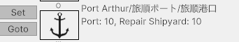

| Type                        | Repair Point Generated | Repair Upper Limit (tons) |
| --------------------------- | ---------------------- | ------------------------- |
| Port (per level)            | 100                    | 0                         |
| Repair Shipyard (per level) | 100                    | 1000                      |
| Repair Ship x1              | 100                    | 0                         |

### Mapped Damage Point

In the SK5 system, the Taken Damage Point for an unsunk ship is sometimes a _good thing_, since a high damage point indicates that the ship’s “instant-kill potential” has been expended—for example, its magazine has been destroyed relatively safely. Therefore, damage points are not listed as a repairable item in the repair system. Instead, they are _forcibly_ restored according to the ratio of the repaired damage’s repair cost to the ship’s total existing repair cost. The forcibly removed damage points are called **“mapped damage points”** in the log.

## Command Structure

Each strategic group has a command point value cost:

- Each land unit under the command will cost the original value.
- Each strategic group under the command will cost 1/3 of its own command point.

Strategic group have a fixed command capacity of 1500. If command point cost is lower than the capacity, the group will be subject to a constant penalty based on commander's Land Operational ability:

| Level | Command Penalty | Tactical Modifier |
| ----- | --------------- | ---------------- |
| Barely Competent | 40% | -10% |
| Average (Unknown) | 30% | 0% |
| Above Average | 20% | 10% |
| Outstanding | 10% | 20% |
| Gifted | 0% | 30% |

In the land battle resolution, a unit's "Chance Cost" (basically cost to "activate" this unit) is modified by every layer of engaged commanding layer:

In the above example, if the 9th Combined Bridge is the leading group (If only 1 independent group is engaged, that group is the leading group. If more than one group is engaged in the land battle, weaker groups would attached to the strongest group temporarily. So there's still only 1 group on the top and other attached group will be subject to extra command layer penalty.). This layer will yield a command penalty of 20% since command point is lower than capacity and commander's Land Operational ability is "above average". On the other hand, 11th Inf Regt layer will generate 32% penalty. So 2nd Bn, 11th Inf Regt and 3rd Bn, 11th Inf Regt would be subject to 52% penalty.

If 5th Div is engaged instead of 9th Combined Bridge, the penalty would be stacked with an extra layer introduced by extra command layer.

This design achieves the following effects:

- Bigger land units are hard to activate, so it's less-effective than smaller unit, that's how I implement the "soft combat width".
- Every engaged operational commander in the commander chain make proper effect, instead of strange positive buf stack by enforced layer (EX: HOI) or just no effect on higher layer (EX: ATG).

The penalty system is designed to mathematically ensure that "flatter" command structures generally incur higher penalties. Thus, Japan's modernized hierarchical command structure will typically perform better than China's pre-Napoleonic structure, which lacked permanent formations above the battalion level.

The tactical modifier, however, only affects directly commanded land units and does not apply through the hierarchy.

## Land Battle Resolution

### Sub Combat

Each turn, every unit generates a "chance" value representing its tactical potential. Two chance values would be consumed in a sequence of generated sub-combat for this turn.

For each sub-combat, the two sides roll with their total chance as weight to determine the initiative side. The initiative side becomes the attacker of the sub-combat, while the opposing side becomes the defender. An attacker unit is rolled according to the power weighting and a defender unit is selected based on strength weighting (so low-effective unit -- those with high suppression, fatigue and low morale) would be more likely to be chosen defender than attacker in sub-combat.

The two engaged units then determine their commitment percentage, which is based on a "reference ratio" (e.g., a 300-man unit attacking a 100-man unit with a 1:1 reference ratio would result in the attacker committing 100 men and the defender committing 100 men). The determination of the reference ratio is heavily influenced by the current situation value, which represents the loss or gain of critical advantageous positions. The situation only shifts when the attacker in the sub-combat achieves a significant advantage by the end of the sub-combat (attacker is not suppressed, defender is suppressed, attacker has higher morale and lower fatigue). This represents a tactical breakthrough that may force the defender to retreat from their current position. Conversely, if the defender achieves a "victory," the situation does not shift, aside from potentially a favorable attrition ratio.

Generating a sub-combat consumes chance from the initiative side based on the unit's state and its commitment percentage.

In an execution of land battle, which may last several turns, the side with the advantage gradually pushes the situation in its favor, gaining increasingly better exchange ratios. The disadvantaged side may launch counterattacks to retake the situation, but may ultimately be unable to sustain the deteriorating exchange ratio and choose to retreat from the hex. They may then retreat to a new hex and start a new battle, where the situation resets — allowing this cycle to potentially repeat.

Thus, sub-combats give the initiative side an upper hand, and having more initiative is almost always beneficial. This can be achieved by:

- More units — generates higher base chance values.
- A more effective command structure and higher commander ability — reduces the chance cost for each sub-combat generated.

For the resolution of a land battle within a single strategic turn (hour), chance is only consumed up to a given percentage (e.g., 90%) before the resolution ends. This threshold can be adjusted to control battle intensity.

### Abstract Firing

A sub combat is consisted of 3 firing exchange. Each firing inflict strength, suppression, morale and fatigue hit. Two side also increase some fatigue.

The 3 non-"physical" effectiveness attribute, suppression, morale and fatigue is defined as:

- Suppression: An effect is somewhat longer than true "fire suppression", but even it's 100% suppressed, most of the value would be restored in the new turn (not 100% is due to some suppression is assumed to happen in the end of last turn). 
- Morale: morale is like suppression, but slower to restore and harder to inflict.
- Fatigue: fatigue is like morale, but slower to restore and harder to inflict. And some fatigue would be imposed without loss.

These value with strength modify the "lethality" (a concept taken from JTS Squad Battle), which effect inflict hits and if a "breakthrough" (situation push) is achieved.

# Game Preference Dialog

The **Game Preference** dialog is available from the top tabs in both tactical and strategic modes. Most fields are applied through live data binding while the dialog is open. Press **Confirm** to store supported preferences for later sessions.

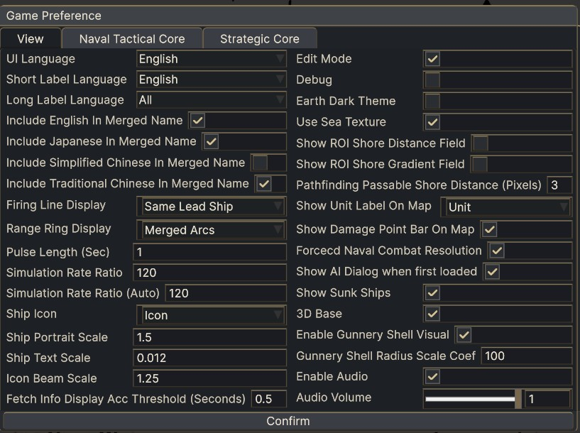

## View

- **UI Language:** changes the game UI locale. It also updates the default short-label language and merged-name language inclusion to match the selected locale.
- **Short Label Language:** selects the language used by short names, such as compact unit/map labels.
	- **English:** use the English short name.
	- **Japanese:** use the Japanese short name, falling back to English if needed.
	- **ChineseSimplified:** use the Simplified Chinese short name, falling back to English if needed.
	- **ChineseTraditional:** use the Traditional Chinese short name, falling back to Simplified Chinese and then English if needed.
	- **All:** use the merged-name form for short labels.
- **Long Label Language:** selects the language mode used when the game asks for a long or merged name.
	- **English:** use the English name.
	- **Japanese:** use the Japanese name
	- **ChineseSimplified:** use the Simplified Chinese name
	- **ChineseTraditional:** use the Traditional Chinese name
	- **All:** build a merged name from the enabled **Include ... In Merged Name** toggles below.
- **Include English In Merged Name:** includes English when a name is shown in merged-name mode.
- **Include Japanese In Merged Name:** includes Japanese when a name is shown in merged-name mode.
- **Include Simplified Chinese In Merged Name:** includes Simplified Chinese when a name is shown in merged-name mode.
- **Include Traditional Chinese In Merged Name:** includes Traditional Chinese when a name is shown in merged-name mode.
- **Firing Line Display:** controls which ships draw firing/targeting lines.
	- **None:** draw no firing lines.
	- **SelectedShip:** draw lines only for the selected ship.
	- **SelectedGroup:** (OOB Group) draw lines for ships in the selected ship's same level-1 group. 
	- **SelectedControlRoot:** (Effective Group) draw lines for ships sharing the selected ship's current control root.
	- **SelectedRootGroup:** (Side) draw lines for ships in the selected ship's root group.
	- **All:** draw lines for all deployed ships.
- **Range Ring Display:** controls weapon range visualization.
	- **Circle:** draw full range circles.
	- **MergedArcs:** merge overlapping valid fire arcs before drawing.
	- **DistinctArcs:** draw valid fire arcs separately.
- **Pulse Length (Sec):** sets the amount of simulation time advanced by the one-pulse command, such as the backquote/tilde hotkey.
- **Simulation Rate Ratio:** sets the tactical time scale used for normal requested advances, such as 1-9 minute advances. A value of `120` means 1 real second advances 120 simulation seconds.
- **Simulation Rate Ratio (Auto):** sets the tactical time scale used by auto-play.
- **Ship Icon:** chooses the ship map presentation style.
	- **Icon:** use a transparent/top image style.
	- **Counter:** use a counter-like top image style.
- **Ship Portrait Scale:** scales the ship model/portrait marker used on the tactical map.
- **Ship Text Scale:** scales text labels attached to ship map markers.
- **Icon Beam Scale:** adjusts the apparent beam/width of icon markers to improve recognition.
- **Fetch Info Display Acc Threshold (Seconds):** sets how long an image/info fetch may run before the loading/busy display is shown.
- **Editor Mode:** enables editing-oriented UI and behavior.
- **Debug:** enables debug-facing bindings and UI elements where the current screen exposes them. It is mainly for development and diagnostics.
- **Earth Dark Theme:** switches the tactical globe/earth shader to the dark-theme variant.
- **Use Sea Texture:** toggles sea texture rendering on the tactical globe.
- **Show ROI Shore Distance Field:** shows the region-of-interest shore distance field used by shore/pathfinding diagnostics.
- **Show ROI Shore Gradient Field:** shows the region-of-interest shore gradient field used by shore/pathfinding diagnostics.
- **Pathfinding Passable Shore Distance (Pixels):** sets the shore clearance threshold used by tactical route/pathfinding tools. Larger values treat more near-shore pixels as blocked.
- **Unit Label:** controls tactical map unit labels.
	- **None:** hide unit labels.
	- **Unit:** show unit name.
	- **Formation:** show only formation's name.
- **Show Damage Point Bar On Map:** shows or hides the damage point bar above deployed ships.
- **Forced Naval Combat Resolution:** in strategic mode, pending naval combats must be resolved before realtime strategic advance can continue. If disabled, strategic advance is allowed to continue past pending naval combat prompts.
- **Show AI Dialog when first loaded:** shows the tactical AI dialog the first time a naval scenario is loaded, unless the scenario disables the startup AI dialog.
- **Show Sunk Ships:** controls whether sunk/destroyed ships remain visible on the tactical map.
- **3D Base:** shows or hides the runtime 3D hull/base under tactical ship portraits.
- **Enable Gunnery Shell Visual:** enables or disables visual shell/projectile effects during tactical gunnery.
- **Gunnery Shell Radius Scale Coef:** scales the radius of gunnery shell visual effects. The value is clamped to at least `1`.
- **Enable Audio:** enables or mutes game audio.
- **Audio Volume:** sets global volume from `0` to `1`.

## Naval Tactical Core

### Balance & Performance

- **Land Collision:** enables land collision checks for ships and torpedoes. When on, movement into land is blocked or torpedoes self-destruct on land.
- **Relaxed Collision:** makes land collision less strict for ships by ignoring very small blocked turning points if a farther point on the same movement line is clear.
- **Ship Collision:** enables ship collision checks during ship movement. Hostile collisions can block movement and may trigger ramming damage.
- **Friendly Ship Collision:** if ship collision is enabled, also treats friendly ship collisions as blocking. If off, friendly overlap is ignored for blocking purposes.
- **Disable Battery Ammunition Cost:** main/secondary battery fire no longer spends battery ammunition.
- **Disable Rapid Firing Battery Ammunition Cost:** rapid-firing battery fire no longer spends rapid-firing ammunition.
- **Battery Detail Show Non-Active Modifier:** shows inactive or neutral fire-control modifiers in battery detail breakdowns instead of hiding entries with no current effect.
- **Global Hit Coef:** multiplies final battery hit probability after table lookup and modifiers.
- **No Penetration Damage Coef:** scales damage points and damage-effect probability for no-penetration shell results.
- **Torpedo Friendly Collision Process Mode:** controls torpedo collision with friendly ships. Hostile torpedo collisions still resolve as hits.
	- **Hit:** friendly torpedo collision resolves as a hit.
	- **Passthrough:** friendly torpedo collision is ignored.
	- **Dub:** friendly torpedo collision ends the torpedo as a dud/end event.
- **Torpedo Firing Angle Error (deg):** adds a random firing-angle error between negative and positive this many degrees to automatic torpedo launches.
- **Disable Torpedo Reload:** disables torpedo reload behavior.
- **Enable Leader Rule Variant:** enables the leader-rule variant, allowing commander Naval Tactical ratings to modify fire-control resolution.

### AI

- **Angle Step (Deg):** sets the heading sample interval for tactical maneuver AI. For example, `18` degrees gives 20 candidate headings around the compass.
- **Attack Coef:** weight applied to the friendly attack score when AI evaluates candidate headings.
- **Defence Coef:** weight applied to reducing enemy attack score against the friendly side.
- **Distance Coef:** weight applied to the preferred combat-range score.
- **Extrapolate Seconds:** how far into the future the tactical maneuver AI projects ships before scoring a candidate heading.
- **Enable ROI Shore-Field Avoidance:** enables the ROI shore-field obstacle avoidance model used by automated/player-controlled movement when avoidance is active.
- **Player Control Obstacle Avoidance:** controls obstacle avoidance for player-controlled ships.
	- **None:** do not apply player-control obstacle avoidance.
	- **Weak:** use the lighter avoidance parameters.
	- **Strong:** use the stricter avoidance parameters.
- **Combat Expected Range (Low, yard):** lower edge of the AI's preferred combat distance band. Being closer than this is penalized.
- **Combat Expected Range (High, yard):** upper edge of the AI's preferred combat distance band. Being farther than this is penalized.
- **Auto Torpedo Firing Range Relaxed Coef:** multiplies torpedo range for automatic torpedo target/firing consideration. A larger value makes auto torpedo use more willing at long range.

### Misc

- **Reference Time Zone:** sets the reference UTC offset used when displaying scenario/log timestamps.

## Strategic Core

- **Day Advance Hour Interval (Sec):** sets the base real-time delay between one-hour strategic turns during realtime strategic advance. Slow mode uses twice this interval; fast mode uses half of it.

# FAQ

## Localization Quality Issues?

The base development language is English, which remains the most polished version. If you encounter questionable translations in other languages, please verify against the English version first.

Current localization approach:

- **Basic UI**: English and Simplified Chinese versions are manually crafted. Japanese and Traditional Chinese are LLM-translated based on the above two languages.
- **Remarks**: Source content with its original language appears at the top; translation follow below.
- **Long Texts** (Help, tutorials, Steam page, etc.): English version are manually written; other languages are LLM-translated from English.
- **Dynamic Content** (Damage effects, combat logs, etc.): Similar to Basic UI.

## Why Don’t Ships Sink Immediately After Reaching 100% Damage Points?

In the SK5 system, reaching 100% Damage Points (DP) does not guarantee a ship will sink. A vessel might survive well beyond 100% DP — or sink instantly from the first hit.

DP primarily drives the generation of General Damage Effects, which can severely impair a ship’s combat capability. The 100% DP mark indicates a high probability that the ship becomes mission-killed (combat ineffective).

Mechanically, 100% DP marks the point at which General Damage Effect checks cease. Beyond this threshold, no further General DE rolls are made, meaning that additional damage is relatively less likely to cause the ship to sink via general damage (you can think of this as the chance of catastrophic explosions, such as magazine detonations, having already been exhausted, so further shell holes above the waterline no longer increase the likelihood of sinking). That said, specific damage effects resulting from normal hits can still sink the ship.

## What is DE XXX (like DE 101?)

DE XXX is "Damage Effect XXX" listed in SK5, though I can't list them since they're behind a paywall, you can check source code to determine their effect in this game. They're not always equivalent though.

## Editing is Not Intuitive

I haven’t written related material since major rework is expected. If you really want to edit something and find it frustrating, contact me (via GitHub issue or Discord server) to let me know someone is really interested, I would write a temp document to explain how to do it in the current stage.

## Why is so much image loading done at runtime?

I want to emulate Tabletop Simulator's approach of loading images dynamically during gameplay, which has both advantages and disadvantages.

## Why Is the Game Size So Large? Shouldn't It Be a Mini Game liek RTW Given the "Minimalist" Graphics?

Similar to games like CMO, the majority of the installation size comes from GIS elevation data. While titles such as Rule the Wave avoid this overhead by using vector data, this project uses raster data — even though ocean depth data has been clamped.

The reason for retaining elevation data is to support a planned tactical land combat generator, which will utilize terrain elevation in future updates. Also elevation data will render location more recognizable and map pretty.

Edit: A pre-calculated distance & gradient field data is added as well to enhance tactical obstacle avoidance.

# Help

## Getting Started

- Right-click and drag to move the camera, use the scroll wheel to adjust the zoom level.
- Press 1 to advance by 1 minute (mouse should be in the map instead ui area)
- Control group leader (icon with a direction arrow) to control a group
	- Change direction: Select a group lead, then hold Shift and left-click a point on the map to set the direction.
    - Change speed: Change value in the slider of right panel
    - Change or inspect a lot of details in editors.
- Use F or R to set Follow and relative to relationship, more parameter can be specified in the Ship State View.

## Automation

- By default, firing is automated, following a somewhat optimal rule, and can be configured in the editor, ranging from doctrine to manual target specification.
- If a unit follow or is relative to a target, it will adjust its speed and course to reach the desired position.
- By default, an independent unit (usually the group leader) maintains its current speed and course. However, if automatic movement is enabled in the doctrine, the unit will adjust its course to maximize firepower while minimizing incoming damage.

## Tactical Naval System Shortcuts

Hotkeys are ignored while a UI Toolkit field or control has keyboard focus. Most map-click tools also require the pointer to be over the map instead of over the UI.

Basic:

- Left Click: Select unit.
- Right Click on the selected unit: Open the Ship State view for it.
- Right Click on the map while a ship is selected: Set course for the selected unit.
- Shift + Left Click: Set course for the selected unit.
- Esc: Cancel the current map command, clear the current ship selection, or leave waypoint/line-tool mode.

Camera:

- Right Click + Drag: Pan the tactical camera.
- Scroll Wheel: Zoom the tactical camera in or out.
- Middle Mouse / Mouse Wheel Button + Drag Up or Down: Tilt the tactical camera into or out of the 3D view.
- H: Return the tactical camera to 2D view.

Movement and formation:

- W: Toggle waypoint route editing for the selected ship.
- I: Detach unit (set control mode to Independent).
- F: Set follow target (extra parameter requires Ship State editor).
- R: Set relative-to target (extra parameter requires Ship State editor).
- M: Move selected ship to another point.
- L: Open Ship State view for the selected ship.

Combat and map tools:

- A: Set the selected ship's ship-level firing target / manual fire constraint.
- D: Distance measuring line.
- S: Line of Sight (check ship masking & Earth curvature).
- P: Pathfinding line.
- Alt + P: Exact pathfinding line.

Time advance:

- 1-9: Advance by 1-9 minutes.
- ` or ~: Advance by one pulse.
- Space: Toggle auto-play in single-player mode. Auto-play is disabled in multiplayer.

Edit:

- Insert: Insert a ship on the map (deploy a non-deployed ship to the map).
- Alt + Insert: Insert a location label.
- Delete: Undeploy the selected ship (move it back to the not-deployed map state).

## Strategic Mode Shortcuts

- Insert: Choose and place a strategic group on the next clicked cell.
- M: Start a new move order for the selected strategic group.
- Alt + M: Edit the selected strategic group's move path.
- A: Append movement to the selected strategic group's planned path.
- Space: Toggle realtime advance.
- Esc: Return to select mode, cancel the pending cell-click command, and clear the current selection.
